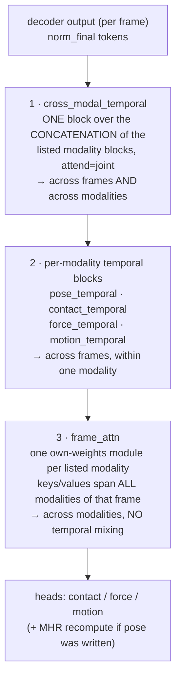

# Architecture

This page explains the model end to end: the frozen SAM 3D Body base we forked, the token blocks
and heads we bolted onto it, the attention mask that makes the graft provably safe, the
post-decoder temporal machinery for video, and the freezing rules that keep all of it honest.

The reader is assumed to know transformers and 3D human pose estimation in general, but nothing
about this repository or about SAM 3D Body specifically. Every repo-specific term is defined at
first use. For the force branch's supervision (physics vs. supervised) see
[`forces.md`](forces.md); for datasets and label semantics see [`data.md`](data.md); for the loss
functions see [`losses.md`](losses.md).

---

## One forward pass


Concretely, for one training step on a clip of climbing video:

1. Each frame is cropped to the climber's bounding box and resized to 512x512. A **clip** of `T`
   consecutive frames becomes `T` independent rows in the batch — the batch is *flattened*, with
   shape `[B_clips * T, ...]`, plus three side-channel keys (`seq_len`, `frame_pos_sec`,
   `frame_valid`) that tell the temporal modules how to fold it back up.
2. A frozen DINOv3 ViT-H/16+ backbone encodes every row to a `[1280, 32, 32]` feature map.
3. A 6-layer promptable transformer decoder runs **per frame**. Its token sequence is the
   original SAM 3D Body tokens (pose, previous-estimate, prompt, hand-detection, 2D keypoint, 3D
   keypoint) followed by our appended blocks: contact tokens, force tokens, motion tokens.
4. An asymmetric attention mask stops every original token from ever reading an appended token.
   Whatever the appended tokens do, the pose output is mathematically identical to the unmodified
   base model's — its Jacobian with respect to every parameter we added is exactly zero.
5. Between decoder layers, each appended token re-samples backbone features at the 2D image
   location of "its" body keypoint, as currently predicted by the decoder's intermediate pose
   estimate. This is what "keypoint-anchored" means.
6. After the decoder, the tokens are still per-frame. A stack of optional **post-decoder blocks**
   mixes them across the clip's frames (temporal attention) and across modalities (cross-modal
   attention, per-frame attention). Every one of these blocks is *zero-gated*: at initialization
   it is an exact identity, so enabling it never perturbs a trained model on step 0.
7. The final tokens go to their heads: contact logits, 3D force vectors, motion (velocity /
   acceleration) vectors. The MHR pose head runs on token 0 as it always did.

Steps 1–5 are per-frame and mask-isolated. Step 6 is where clips actually become clips, and where
the deliberate exceptions to pose isolation live.

---

## The base model: SAM 3D Body

**SAM 3D Body** is Meta's single-image 3D human mesh recovery model. Given one RGB crop of a
person it predicts a posed 3D body plus the camera translation that reprojects it onto the image.
We use the released `facebook/sam-3d-body-dinov3` checkpoint and never train a single one of its
parameters. Everything below describes the shipped checkpoint's own `model_config.yaml` — the file
that travels with the weights and that `contact/model.py` patches before construction.

### Backbone

The image encoder is **DINOv3** ViT-H/16+ (`dinov3_vith16plus`) — a self-supervised vision
transformer from the DINO family, here at "huge-plus" scale with 16x16 patches and embedding width
1280. The input crop is 512x512, so the output feature map is `[B, 1280, 32, 32]`. The backbone
runs in **bfloat16** (`TRAIN.USE_FP16` with `FP16_TYPE: bfloat16`); the decoder and the pose/camera
heads stay in fp32, because the MHR head's sparse rig operations are not fp16-compatible. That
split is inherited from upstream and we do not touch it.

Two more frozen pieces touch the image features before the decoder consumes them: a
segmentation-mask embedding (`MASK_EMBED_TYPE: v2`, added in `forward_pose_branch`, which is why
the datasets carry person masks) and a camera "ray conditioning" encoder (`CameraEncoder`, applied
at the top of `forward_decoder`) that injects per-pixel viewing-ray geometry so the model can
reason about a crop's position in the full frame.

### Promptable decoder and its typed tokens

The decoder (`sam_3d_body/models/decoders/promptable_decoder.py`) is a 6-layer transformer with
token width 1024 and 8 attention heads. Each layer does: masked **self-attention over the tokens**,
then **cross-attention from tokens into the image features**, then an FFN. The image-to-token
direction (`ENABLE_TWOWAY`) is **off** in the shipped config, so tokens read the image but never
write into it — a fact we lean on heavily in [the isolation argument](#the-attention-mask).

"Promptable" means the sequence is a bank of *typed* tokens rather than a single query, in the
style of SAM. For the shipped body configuration the sequence is:

| Index | Block | Count | What it is |
|---|---|---|---|
| 0 | pose token | 1 | The token the MHR + camera heads read. Initialized by projecting a learned zero-pose embedding, a zero-initialized camera embedding, and CLIFF-style crop conditioning — the bounding box's offset from the principal point and its scale, divided by focal length, so the network knows where in the full frame this crop came from. |
| 1 | previous-estimate token | 1 | Encodes a previous pose estimate for iterative refinement. |
| 2 | prompt token(s) | 1 per click | User keypoint clicks. In all of our training and evaluation this is a single **dummy** prompt `[0, 0, -2]` (label `-2` = "invalid"), i.e. we always run the unprompted path. |
| 3–4 | hand-detection tokens | 2 | Left/right hand presence + box regression. |
| 5–74 | 2D keypoint tokens | 70 | One per MHR70 keypoint (see below). |
| 75–144 | 3D keypoint tokens | 70 | Same, for 3D. |

So the original sequence is **145 tokens**. Our blocks are appended after index 144.

**MHR70** is the model's 70-keypoint skeleton. Indices 0–20 are body and foot landmarks (`0 nose`,
`5/6` shoulders, `7/8` elbows, `9/10` hips, `11/12` knees, `13/14` ankles, `15/18` big toes,
`17/20` heels, …); indices 21–41 are the right hand and 42–62 the left hand, with the **wrists**
sitting at the *end* of those hand chains — `41 = right_wrist`, `62 = left_wrist`. That non-obvious
placement is why our climbing anchor lists look like `[62, 41, 13, 14]` rather than something
tidier. Indices 63–69 are extra landmarks (olecranon, cubital fossa, acromion, neck). There is no
pelvis keypoint; the model's own pelvis proxy is `mean(kp[9], kp[10])`, the hip midpoint.

Between decoder layers the model runs an **intermediate prediction**: it feeds the current
(layer-normed) token 0 through the pose and camera heads, projects the resulting 3D keypoints to
2D, and uses those 2D locations to re-anchor the keypoint tokens — each keypoint token writes a
positional encoding of its own predicted 2D location and adds bilinearly-sampled backbone features
from that location. This "iterative refinement by re-sampling where you currently think the joint
is" is the mechanism our appended tokens copy verbatim.

### The MHR head and the camera head

**MHR** stands for **Meta Human Rig** — Meta's parametric body rig, and the thing this model
actually regresses. The familiar parametric human body model in this literature is **SMPL** (and
its whole-body extension **SMPL-X**): a rig plus learned shape and pose blend-shape bases, so that a
few hundred parameters produce a full posed mesh. MHR is a model in that family but is not SMPL —
different joint hierarchy, different shape/scale bases, 18439 native vertices instead of SMPL's 6890
or SMPL-X's 10475. Converting between the two is a real operation, not a relabeling (see
`conversion/smplx_smpl_conversion/`).

`MHRHead` (`sam_3d_body/models/heads/mhr_head.py`) maps the 1024-d pose token through an FFN to a
flat parameter vector — 6-d global rotation (continuous 6D rotation representation), 260 continuous
body-pose channels, 45 shape components, 28 scale components, 2x54 hand components and 72 face
components (face is zeroed out). Those parameters are pushed through the MHR rig to produce
`pred_vertices`, `pred_keypoints_3d` (the 70 keypoints), joint rotations, and the model parameters
themselves. The head's constant tables (rig data, blend shapes) are
`nn.Parameter`s with `requires_grad=False` — only `head_pose.proj`, the FFN, is a "real" learnable
layer, which matters in [the pose paths section](#the-pose-paths).

The camera head (`PerspectiveHead`) reads the *same* pose token and predicts a 3-vector `(s, tx,
ty)`, which combined with the crop geometry and the true camera intrinsics gives a metric
translation `pred_cam_t` and a full-perspective reprojection of the 3D keypoints and vertices to
the original image. This is the CLIFF / CameraHMR line of full-frame-aware crop regression, and it
is what makes predictions comparable across crops of different scale and position.

The two heads together produce the dict this repo calls `out["mhr"]`: `global_rot`, `body_pose`,
`shape`, `scale`, `pred_keypoints_3d`, `pred_vertices`, `pred_keypoints_2d`, `pred_cam_t`, and so
on. A parallel hand decoder (`forward_decoder_hand`) exists upstream; we never run it — every
forward in this repo is `decoder_type="body"`.

---

## Our token blocks

We add up to three blocks of tokens, always appended **after** all 145 original tokens, always in
the same order: **contact, then force, then motion**. Each block is a learned `nn.Embedding`
(one row per token, width 1024), and each token in a block is *keypoint-anchored*.

### What "keypoint-anchored" means

An anchored token is tied to one MHR70 keypoint index. After every decoder layer except the last,
`_anchored_token_update` (`sam_3d_body/models/meta_arch/sam3d_body.py`) does two things for that
token:

1. **Position**: it encodes the *currently predicted* 2D crop-space location of that keypoint
   through a small FFN and writes the result into the token's slot of the positional stream
   (`token_augment`). That stream is added to attention queries and keys, never to the residual
   stream.
2. **Appearance**: it bilinearly grid-samples the backbone feature map at that same 2D location —
   optionally over a `grid_size x grid_size` neighbourhood of radius `grid_radius`, averaged; the
   climbing configs use 5x5 at radius 0.1 — projects `1280 -> 1024`, and **adds** it to the token.

Anchors whose predicted keypoint falls outside the crop or behind the camera (depth `< 1e-5`)
contribute exactly zero from both paths. Because the anchor location comes from the decoder's own
intermediate pose estimate, the token literally follows the limb around the image as the pose
estimate sharpens over the six layers.

This is a strong inductive bias: instead of asking a global token to figure out where the left hand
is, we hand it a feature vector cropped at the left hand.

### Contact tokens

Configured by `model.contact_head`. Two knobs decide the count:

- `contact_keypoint_indices` — the anchor list. Default is `list(range(21))`, i.e. all 21
  body/foot landmarks. The four-extremity climbing configuration uses `[62, 41, 13, 14]` =
  left wrist, right wrist, left ankle, right ankle. The six-group force experiments
  use `[62, 41, 15, 18, 17, 20]` = left/right wrist, left/right big toe,
  left/right heel — matching the six force groups one-to-one.
- `num_global_tokens` — extra tokens that are **not** anchored and never receive the anchored
  update. They only see the image through decoder cross-attention and the body tokens through
  self-attention. Base default is 3; the per-token climbing configs use 0.

There is also an ablation switch, `blind_to_image`, which severs *every* image path into the
contact tokens: the anchored update is skipped entirely (and its two projection layers are not even
built — a parameter that never receives a gradient makes PyTorch's DistributedDataParallel error out
unless `find_unused_parameters` is on), and the decoder's image cross-attention output
is multiplied by zero on the contact rows before its residual add. Zeroing the cross-attention
*output* rather than masking its input avoids a fully-masked softmax row (which would be NaN) and
leaves every other row bit-identical. That ablation asked "can the contact tokens do it from body
pose alone?"; see [`experiments.md`](experiments.md).

### Force tokens

Configured by `model.force_head`. `force_keypoint_indices: null` makes the force tokens inherit the
contact anchors (the original four-extremity design, which the physics loss depends on). An
explicit list decouples them — and, crucially, enables **force-only builds**: if no contact target
is enabled, `DO_CONTACT_TOKENS` is false, there are no contact tokens and no contact head at all,
and the force block sits directly after the original 145 tokens. There are never global force
tokens.

The six-group supervised-force line uses the six kindyn anchors `[62, 41, 15, 18, 17, 20]`. ("**kindyn**"
= kinodynamics — the inverse-dynamics solve in the sibling BetterVideoReconstruction pipeline that
produces our ground-truth forces. See [`data.md`](data.md).)

### Motion tokens

Configured by `model.motion_head`. Motion anchors are **always explicit** (no inheritance) and there
are no global motion tokens, so the token count is exactly the anchor list's length. The base
default is `[62, 41, 15, 18, 17, 20, 9]` — the six force anchors plus MHR70 `9` (left hip). That
last one is a deliberate hack: MHR70 has no pelvis keypoint, so a pelvis motion token is anchored at
the left hip purely to decide *where it grid-samples image features*; its supervision target is the
true kindyn pelvis joint. The current all-modality configuration uses a single motion token, `[9]`.

### Sequence layout

```
[ 0 ]  pose token
[ 1 ]  previous-estimate token
[ 2 ]  prompt token (dummy)
[3,4]  hand-detection tokens
[5..74]    2D keypoint tokens  (70)
[75..144]  3D keypoint tokens  (70)
---------------------------------- appended blocks start here
[145 .. ]  contact tokens   (anchored + global)     if enabled
[  .. ]    force tokens     (anchored)              if enabled
[  .. ]    motion tokens    (anchored)              if enabled
```

Every block is optional and independently sized, but the *order* is fixed — the mask regime below
is defined in terms of it.

---

## The attention mask

This is the central design idea of the fork, and the reason we can claim the base model is
untouched rather than merely "frozen".

Freezing parameters is not enough. If a contact token could be *read* by the pose token, then even
with frozen weights the pose output would become a function of the contact token's contents, and
therefore of the contact parameters. Gradients would flow, predictions would drift, and the
carefully calibrated SAM 3D Body pose estimate would degrade as a side effect of training a contact
classifier.

So we build an **asymmetric** token-token attention mask (`_build_block_token_mask`). It is a bool
tensor `[B, N, N]` where `True` means "query row may attend this key column", passed straight into
the decoder's self-attention at every layer. The rule is one line:

```python
for start in block_starts:
    token_mask[:, :start, start:] = False   # nothing before `start` may read anything at/after it
```

Passing the start index of *every* appended block gives the **`causal`** regime (the default,
`model.extra_token_attention: causal`) — block-triangular:

- original tokens read nothing appended;
- contact tokens read the originals and each other, but not force or motion;
- force tokens read originals + contact, but not motion;
- motion tokens read everything before them.

Passing only the *first* block's start gives the **`mutual`** regime: the single barrier in front of
the first appended block stays, so the original tokens are still blind to everything we added, but
contact, force and motion tokens fully inter-attend.


Note what the mask does *not* touch: image cross-attention. Every token, ours included, freely
cross-attends the image features. That is fine, because cross-attention is per-query-row independent
(keys and values are image-only) and — with `ENABLE_TWOWAY: false` — no token ever writes back into
the image. The image features the pose token reads are exactly the ones it would read in the
unmodified model.

### D1

Throughout this repo and its configs, **D1** is the shorthand for the gradient-isolation property
the `causal` regime buys: *an earlier appended block's outputs have an exactly-zero Jacobian with
respect to every later block's parameters.* Concretely, contact outputs cannot move when force or
motion parameters change, and force outputs cannot move when motion parameters change.

Note the direction. The relation is **not** symmetric: force tokens *do* read contact tokens, so
force outputs are a function of contact parameters. `CLAUDE.md` writes this as `contact ⊥ {force,
motion}` and `force ⊥ motion`, which should be read as "is unaffected by", not "is independent of".

That asymmetry is exactly what made the force line tractable. We could warm-start from a trained,
already-validated contact head, freeze it, and run force experiments as clean single-variable arms:
whatever the force branch does, the reported contact numbers *cannot* change, so any difference
between two force runs is attributable to the force change alone.

`mutual` deliberately gives D1 up among the appended blocks in exchange for letting them condition
on each other inside the decoder. The choice is recorded in the checkpoint's architecture signature
(a checkpoint trained under one regime will refuse to load under the other), and `mutual` hard-errors
in combination with `train.freeze_contact` — under `mutual` the frozen contact tokens would attend
the *trainable* force/motion tokens, so the supposedly frozen contact outputs would drift as force
training moves those tokens (`contact/config.py`).

The pose/MHR isolation is **not** given up in either regime. That barrier is the first one and it is
always present.

### Isolation is tested, not asserted

`tests/test_temporal_invariance.py`, `tests/test_force_invariance.py`,
`tests/test_motion_invariance.py` and the GPU tests in `tests/test_cross_modal.py` all follow the
same protocol, because a naive `torch.equal` check would fail for an uninteresting reason: the
frozen SAM 3D Body forward is **not** run-to-run bit-deterministic on CUDA. Two identical passes of
the same model on the same batch already differ by ~1e-7 on contact logits and ~5e-7 on keypoints.

So the tests *calibrate against that noise floor*: measure it with two disabled passes, then require
that (a) with our modules randomized to non-zero weights the pose/MHR/keypoint outputs stay within a
small multiple of the floor, while (b) the new branch's own outputs move by orders of magnitude more
than the floor. Run them (`pytest -m slow`) after touching any decoder hook.

---

## Heads

The force head, the motion head, and the contact head's `per_token` mode share a shape: a small FFN
applied along the **token axis**, so the same weights run independently on every token (the contact
head's `concat` and `attention` pooling modes instead combine all tokens first — see below). All are
built by `build_head` in `sam_3d_body/models/heads/`.

### Contact head

`head_contact` is an `nn.ModuleDict` — one independent head per enabled *target*, keyed by target
name, so a single model can predict per-vertex and per-joint contact simultaneously. Output lands in
`out["contact"]["<target>_logits"]` and `..._probs` (sigmoid).

`ContactHead` has three pooling modes:

- **`concat`** — flatten all `K` tokens to `K*1024`, project back to 1024, then MLP to
  `output_dims`. Used when the output is a large fixed vector: per-vertex contact over SMPL (6890)
  or SMPL-X (10475) — the parametric body meshes the still-image datasets are annotated in. (MHR's
  own 18439-vertex topology is deliberately *not* a supported training target;
  `contact.topology: mhr` raises `NotImplementedError`.)
- **`attention`** — a learned query attends over the tokens to a single pooled vector, then MLP.
- **`per_token`** — one shared FFN maps each token to a single logit: `[B, K, 1024] -> [B, K]`. This
  requires `output_dims == K` and is the mode all climbing configs use: four tokens for the
  four-extremity target (`[B, 4]`), six for the kindyn-group target (`[B, 6]`). The point is that
  each output logit is produced from the token anchored at exactly the limb it describes.

Joint targets come in three sets (`contact/targets.py`): `smplx_body_22` (the 22 SMPL-X body
joints), `extremities_4` (`left_hand, right_hand, left_foot, right_foot`, where each foot is
`ankle OR foot`), and `kindyn_6` (`left_hand, right_hand, left_foot`=toe, `right_foot`=toe,
`left_ankle`=heel, `right_ankle`=heel — matched 1:1 to the kindyn force groups).

### Force head

`ForceHead` maps `[B, K, 1024] -> [B, K, 3]`: one 3D vector per force token, no activation. Output
lands in `out["force"]["joint_forces"]`.

Units are **body weight (bw)** — dimensionless, force divided by the climber's weight `m*g`. This
keeps the target scale-free across climbers. The frame the vector lives in is a config choice
(`model.force_head.frame`), consumed by the *loss*, not the model: `local_world_aligned` and `local`
for the physics regime, `root` (body-root frame) for the supervised regime — see
[`forces.md`](forces.md#what-the-numbers-mean-units-and-frame).

The final linear is **zero-initialized**, so an untrained force branch predicts exactly zero force
everywhere. That is a meaningful curriculum start rather than a technicality: under the physics loss
the residual then reduces to the pure-kinematics baseline before any force is learned.

An optional **contact gate** (`model.force_head.contact_gate`) multiplies the final force output by
`sigmoid(sharpness * contact_logit)` per group, using the six `kindyn_6` contact logits matched 1:1
to the six force groups (heel force gated by ankle contact, toe force by foot contact). The logits
are **detached** unconditionally, so the force loss cannot rewrite the calibrated contact
probabilities through this product. The ungated tensor survives as `joint_forces_raw` for
diagnostics. The gate runs *after* the temporal blocks, so evaluation, inference and rendering all
see gated forces.

### Motion head

`MotionHead` maps `[B, K, 1024] -> [B, K, 6]` or `[B, K, 12]`. The first six channels are
**standardized** root-frame linear velocity and acceleration; with `motion_supervision.angular` the
head widens to 12 and adds the angular velocity and acceleration of the root body **twist** (a twist
is the 6-vector of linear plus angular velocity of a rigid body, the standard screw-theory
representation robotics libraries differentiate a pose trajectory into). "Standardized"
means the loss owns a pinned per-channel mean/std table and the head never sees physical units;
"root frame" means the body-root axes, so the target is camera-independent. Outputs land in
`out["motion"]` as `joint_vel`, `joint_acc`, `joint_motion` (and `joint_ang_vel` / `joint_ang_acc`).

Zero-init again: at initialization every token predicts the standardized mean, i.e. the dataset's
average velocity and acceleration.

A per-frame motion head is, on its own, incapable of representing a derivative — a single frame does
not contain velocity. So a temporal block over the motion tokens is not an enhancement here, it is a
precondition. Which brings us to the next section.

---

## Temporal processing

### Clips as flattened batches

There is no separate "video model". A clip is `T` frames occupying `T` consecutive rows of an
ordinary batch, clip-major and frame-minor: rows `0..T-1` are clip 0, rows `T..2T-1` are clip 1, and
so on. Everything upstream of the temporal blocks — backbone, decoder, anchored updates — treats
those rows as unrelated images. Three collated keys carry the structure (`contact/data/collate.py`):

- `seq_len` — an int `T`, identical for the whole batch. Batches are **homogeneous-T** by
  construction; mixing clip lengths in one batch raises.
- `frame_pos_sec` — `[B_flat]` float, elapsed seconds of each frame relative to its clip's first
  frame. Real seconds, not frame indices, so a clip sampled at stride 2 from a 60-fps scene and a
  clip at stride 1 from a 30-fps scene encode the same physical spacing.
- `frame_valid` — `[B_flat]` bool, per-frame validity.

A still image is simply `T = 1`. That is what lets image (per-vertex) datasets and video (per-joint)
datasets share a training run: the collate normalizes stills to length-1 clips, and at `T = 1` the
temporal modules see a single frame with zero positional encoding and nothing to attend to.

### The zero-gated temporal block

`ContactTemporalModule` (`sam_3d_body/models/modules/temporal.py`, used for *all* temporal blocks
despite the historical name) reshapes `[B_clips*T, K, C]` to `[B_clips, T, K, C]` and runs
self-attention across the `T` axis. Each layer is a pre-LN transformer block:

```
x <- x + gamma_attn * MHA(LN(x) + pos_emb)
x <- x + gamma_ffn  * FFN(LN(x))
```

with **`gamma_attn` and `gamma_ffn` initialized to zeros**. That is **zero-gating**: at
initialization every branch contributes exactly nothing and the module is a bitwise identity
(`torch.equal`-verified in `tests/test_temporal.py`). It matters for two reasons. First, you can add
a temporal block to a trained per-frame checkpoint and the first step reproduces it exactly — no
warm-up damage, no re-calibration. Second, an ablation "is the temporal block doing anything?" has a
clean answer: look at how far the gammas moved off zero.

Two further details preserve the exact-identity property:

- The block runs at a **bottleneck width** (default 256, from 1024) through an in-projection and a
  **bias-free** out-projection, and only the *delta* is added back: `residual +
  token_out_proj(out - working)`. A bias on the out-projection would break exact identity at init.
- The fork's own `LayerScale` wrapper turns `scale <= 0` into an `nn.Identity`, which would silently
  drop the gate *and its gradient*. So these modules use explicit `nn.Parameter(zeros)` gates and
  plain `nn.MultiheadAttention` instead of reusing the fork's wrappers. This is called out in the
  module docstring because it is exactly the kind of thing that would produce a silently dead
  experiment.

**Positional encoding** is a sinusoidal encoding of `frame_pos_sec * position_scale`, added to the
attention query/key branch only, never to the residual stream. Working in real elapsed seconds keeps
the encoding stride- and fps-aware; every shipped climbing experiment sets `position_scale: 30.0`
(the base default is 1.0 for all but `pose_temporal`), mapping 30-fps timestamps onto roughly
integer frame offsets, which separates neighbouring frames well.

**Attention scope** is `attend: joint` (all `T*K` tokens of a clip attend jointly, so limbs can talk
to each other across time) or `attend: per_token` (each token slot attends only over `T`, so each
limb mixes only with itself). **`causal: true`** restricts each query frame to non-future keys.
Invalid key frames are hidden from every query, except that a query may always see its own frame, so
no softmax row is ever fully masked.

`window_frames` allows a checkpoint trained at `T = 5` to run inside a longer clip while seeing
exactly its native centered window (positions re-zeroed to the window start); frames outside the
window pass through unchanged.

### Placement: post-decoder only

Temporal modules run **after** the decoder, on token blocks sliced from its `norm_final` output. The
in-decoder placements we tried — `between_layers`, `between_layers_cross`, `pre_decoder`, and a
temporal-convolution variant — were all controlled negatives, and the code for them has been deleted
rather than left as dead configuration. No kept checkpoint uses them. See
[`experiments.md`](experiments.md).

### The post-decoder bricks, in order

Three kinds of post-decoder module can be enabled. We call them **bricks**: independent, composable,
each zero-gated, each nameable in config, each safe to add to an existing run. They always execute
in this fixed order, regardless of how the config lists them:




**1. `cross_modal_temporal`** — a *single* temporal block (`attend` fixed to `joint`) run over the
**concatenation** of the chosen modality token blocks. `modalities` is any subset of
`{pose, contact, force, motion}` with at least two entries; the blocks are concatenated in canonical
sequence order (pose < contact < force < motion) regardless of how the config lists them. Every
participating token attends every other participating token across every frame of the clip. In the
all-modality configuration — **allmod**, `configs/climbing_corpus_allmod.yaml`, the run that trains
pose, contact, force and motion together — that is 14 tokens (1 pose + 6 contact + 6 force +
1 motion) attending jointly over `T = 7` frames, and it is the *only* cross-frame path in that
build (every per-modality temporal block is off). Updated slices are scattered back into their
original positions; everything between them is untouched. This brick relaxes D1 among its
participants — deliberately.

**2. Per-modality temporal blocks** — `contact_temporal`, `force_temporal`, `motion_temporal`,
`pose_temporal`. Each is its own `ContactTemporalModule` over its own token block only, so
information crosses frames but not modalities. `pose_temporal` is a special case discussed below.

**3. `frame_attn`** — per-frame attention with **no** temporal mixing at all
(`sam_3d_body/models/modules/frame_attention.py`). One own-weights `FrameAttentionModule` per listed
modality; each module's queries are its own modality's tokens and its keys/values span **every**
enabled modality's post-temporal tokens *of the same frame* (including the pose token, read-only
unless `pose` is itself a listed modality). Frames are independent by construction — the batch
dimension *is* the flattened frame dimension — so this brick behaves identically on clips and on
single images and needs no `seq_len` plumbing at all.

Order-independence is enforced explicitly: all modules read from **one consistent snapshot** taken
before any of them run, and only then are the updates applied. Listing `[contact, force]` gives the
same result as listing `[force, contact]`.

Heads run last, after `frame_attn`, so every head reads a fully post-processed token.

---

## The pose paths

By default the frozen pose output cannot move. There are exactly **three** ways to let it, and each
is an explicit, individually-named opt-in.

1. **`model.pose_temporal`** — a zero-gated temporal module over the pose token (index 0) only,
   run as the pose modality's per-modality temporal block. It mixes the pose token across the
   clip's frames, i.e. it lets the single-image model borrow evidence from neighbouring frames.
2. **The `pose` modality of a cross-modal brick** — listing `pose` in
   `model.cross_modal_temporal.modalities` or `model.frame_attn.modalities` makes those bricks
   *write* the pose token, not just read it.
3. **`train.finetune_pose_head`** — unfreezes `head_pose.proj` (the MHR head's FFN; its constant
   rig tables and the entire `head_pose_hand` branch stay frozen) as its own optimizer parameter
   group at `optim.lr * train.pose_head_lr_scale` (default 0.1x). This one lives *outside* the
   name-based freeze filter and so is handled explicitly in both `contact/model.py` and
   `scripts/train.py`.

All three require `pose_supervision` to be enabled — config validation refuses a build with a
trainable pose path and no pose objective, because an unconstrained pose token under a
contact/force/motion loss will happily wander somewhere convenient for those losses and useless as a
body estimate.

### The recompute hook and the frozen anchors

Paths 1 and 2 modify a token *after* the decoder has already produced its pose output. So
`_recompute_final_pose_output` re-runs the pose and camera heads on the updated token and replaces
**only the final entry** of the intermediate-prediction list. The five intermediate predictions, the
keypoint-token updates and every other token block still see the untouched token — so
contact/force/motion outputs cannot move as a side effect of a pose write.

The same hook stashes two **frozen anchors** on the recomputed output:

```python
_final["pred_cam_t_frozen"] = _old.get("pred_cam_t_frozen", _old["pred_cam_t"].detach())
_final["global_rot_frozen"] = _old.get("global_rot_frozen", _old["global_rot"].detach())
```

The `.get` with a default is the load-bearing part: on the *first* recompute the predecessor is the
frozen model's own final output, so the stash captures what the unmodified base model predicted;
every later recompute carries that same value through rather than overwriting it. The result is a
detached record of "what the frozen model said", available to any loss that wants a trust region
around it. `contact/motion_consistency.py` uses both, in what the configs call **rails**
(`loss.cam_rail`, `loss.rot_rail`): a penalty that is exactly zero inside a margin and grows
linearly beyond it, so it is inert for a healthy model and only bites when the prediction runs away.
They close null spaces where a derivative-only objective could drift the absolute camera translation
or global orientation arbitrarily far — a failure we actually hit. Those are loss-side details; see
[`losses.md`](losses.md).

Absence of `pred_cam_t_frozen` on the output is itself informative: it means no pose write path is
active, so nothing can have drifted.

---

## Freezing machinery and invariants

### The name-based freeze filter

`contact/model.py::build_model` freezes **every** parameter, then unfreezes by substring match on
the dotted parameter name:

```python
"contact" in name or "force" in name or "motion" in name
    or "cross_modal" in name or "frame_attn" in name or "pose_temporal" in name
```

This is blunt on purpose. It means any new trainable module must carry one of those substrings in
its attribute path — a convention, checked by `tests/test_cross_modal.py`, that has held for every
brick we have added. It also means `head_pose.proj` (which contains none of them) can only become
trainable through the explicit `train.finetune_pose_head` flag, which `scripts/train.py` also has to
add to the checkpoint's saved-name set by hand.

Two regime switches ride on top:

- **`train.freeze_contact`** — "regime (a)": after the normal unfreeze, re-freeze every
  `contact`-named parameter, so only the force branch trains. Requires
  `model.init_contact_checkpoint` (a warm-start from a trained contact run) and rejects both
  `mutual` and `contact` in `cross_modal_temporal.modalities`. Regime (b) is the alternative where
  contact stays trainable alongside force — under the physics loss that regime leaks physics
  gradients into the contact head through force→contact attention, which the trainer warns about
  and which all shipped force runs avoid by using regime (a). See
  [`forces.md`](forces.md).
- **`train.finetune_pose_head`** — described above.

For the current all-modality configuration this comes out to roughly 17M trainable parameters;
`build_model` prints the exact count and the fraction of the total at startup.

### Eval-pinning

A subtler failure mode: the frozen DINOv3 backbone ships with `DROP_PATH_RATE: 0.1` — stochastic
depth. A global `model.train()` would put the *frozen* backbone into training mode, making the
features our trainable heads read nondeterministic from step to step. Dropout in frozen decoder
layers has the same problem.

`pin_frozen_eval` fixes this by replacing `model.train` with a function that first forces the
**whole** model to eval, then walks the tree and re-enables train mode only on subtrees that
actually need it. The rule is derived from `requires_grad` **at call time**, not from a name list:

- a subtree whose parameters are *all* trainable follows the requested mode in full — including its
  parameter-less `nn.Dropout` children, which a rule keyed on direct trainable parameters would
  silently disable;
- a fully-frozen subtree (a contact head frozen by `train.freeze_contact`, say) stays in eval;
- a mixed container is descended into.

Because it reads `requires_grad`, it automatically tracks whichever branch is training without
needing to know anything about the configuration.

### The invariants, restated

These are the properties every change to the decoder hooks has to preserve. They are listed in
`CLAUDE.md` as the repository's non-negotiables and are all test-enforced.

1. **Freeze filter is name-based.** New trainable modules must carry `contact`, `force`, `motion`,
   `cross_modal`, `frame_attn` or `pose_temporal` in their attribute path — or be handled as an
   explicit exception like `head_pose.proj`.
2. **Mask invariant.** Inside the decoder, original tokens never attend appended tokens. Pose/MHR
   outputs have an exactly-zero Jacobian with respect to every contact/force/motion parameter under
   either mask regime. Under `causal`, additionally, no earlier appended block attends a later one
   (D1). The post-decoder bricks relax D1 among their listed modalities in the same deliberate way;
   the frozen pose/MHR outputs stay isolated unless `pose` is a *written* modality.
3. **Frozen modules are eval-pinned**, per the mechanism above.
4. **MHR invariance is tested**, against the measured CUDA noise floor rather than against bitwise
   equality.
5. **Precision layout stays as shipped**: backbone bfloat16, decoder and MHR/camera heads fp32.

### Two efficiency flags that are provably no-ops

`train.backbone_no_grad` wraps *only* the backbone call in `torch.no_grad()`. It is sound precisely
because the backbone is fully frozen — `build_model` asserts there are no trainable backbone
parameters before allowing the flag. `train.detach_interm_preds` runs the decoder's per-layer
intermediate MHR/camera predictions under `no_grad`: those predictions supply *grid-sample locations*
for the anchored token updates and nothing else, and every gradient path through them dead-ends in
frozen parameters. The trainable projection layers still run with gradients, consuming detached
locations. Both default to true and buy roughly 20% step time. Both are gradient-asserted no-ops,
and both fall back to full-graph behaviour when the config key is absent, so the vendored fork stays
usable standalone.

---

## Where to read next

- [`data.md`](data.md) — datasets, label semantics, kindyn ground truth, splits, clip sampling.
- [`losses.md`](losses.md) — every supervision signal and exactly which parameters each gradient
  reaches.
- [`forces.md`](forces.md) — the force branch in depth: units, frames, the RNEA (Recursive
  Newton–Euler Algorithm — the standard recursive inverse-dynamics solver) physics residual, the
  supervised kindyn regime, and the failure modes we worked through.
- [`experiments.md`](experiments.md) — what we actually tried, in order, and what happened.
- [`glossary.md`](glossary.md) — A–Z of the terms above.

Primary code entry points: `contact/model.py` (build, freeze, eval-pin),
`sam_3d_body/models/meta_arch/sam3d_body.py` (`_initialze_model` for construction, `forward_decoder`
for the token sequence, masks, bricks and heads), `sam_3d_body/models/modules/temporal.py` and
`frame_attention.py` (the bricks), `sam_3d_body/models/heads/` (the heads), and `configs/base.yaml`
(commented defaults for most knobs on this page; the `motion_consistency` defaults live in
`contact/config.py`).
