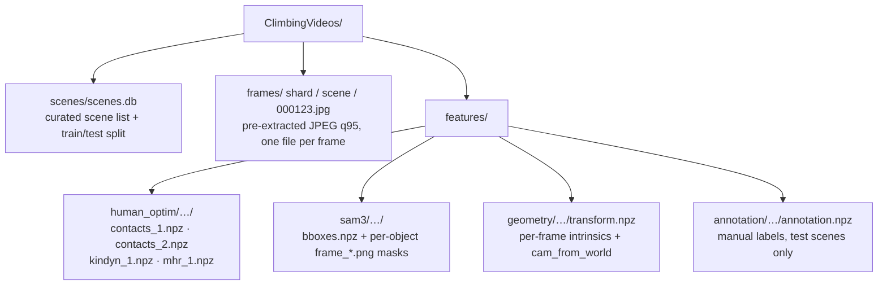
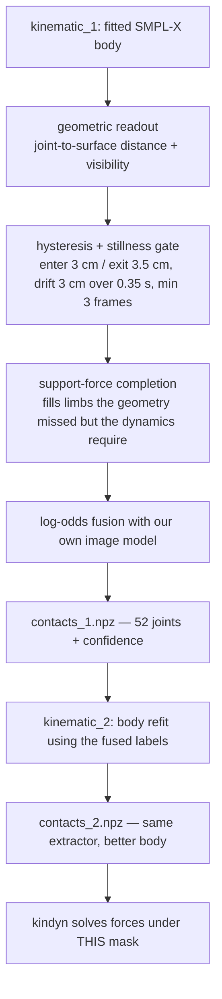

# Data — datasets, labels, and every ground-truth signal

> **2026-08-27 — the corpus was regenerated; the loader is adapted, this page's corpus sections
> are partially stale.** The new corpus has better contact/force/pose ground truth, **864 train /
> 108 test scenes (31 annotated)**, and a new archive schema: `contacts_*.npz` carries
> `contact_label_schema` 2 with `joint_label_confidence` (NaN = joint not assessed — spines, neck,
> individual fingers); `kindyn_1.npz` stores forces on **35 named contact frames in world-frame
> newtons** (`frame_forces`), a per-frame `force_confidence`, a fitted `gravity_world` (tilts up
> to ~27° from `[0, 1, 0]`), and a 211-dim `q`. `contact/data/climbing_corpus.py` folds the
> frames into the six groups by parent joint (hands sum palm + fingers + thumb into the wrist;
> non-group frames — knees, sit, elbows… ~4 % of force mass — are dropped), converts to
> body-weight units in the root frame by default (`force_supervision.gt_frame` / `units` offer
> world / newtons), and the force loss weights rows by `force_confidence`. `mhr_1.npz` pose
> pseudo-GT is **not yet regenerated** for the new scenes. Results across the two corpora are not
> comparable.

This page explains what the model is trained on. It covers the five datasets the repo can read,
what one training example actually is, where every label comes from, and — the part that takes the
most care — what those labels *mean*, because several of them are not what their names suggest.

Some vocabulary first, because it recurs everywhere below.

- **SMPL** is the standard parametric human body model: a triangle mesh with **6890 vertices**
  driven by a shape vector and a pose vector. **SMPL-X** is its successor with **10475 vertices**
  and articulated hands and face. Both expose a skeleton; the first **22 SMPL-X joints** (pelvis,
  spine, limbs, head, wrists — everything except fingers) are what this repo calls **body-22**.
- **MHR** ("Meta Human Rig") is the body model the frozen base network — Meta's SAM 3D Body —
  actually predicts. It is a different rig from SMPL-X, with its own joints and its own
  configuration vector `q`. Anything that wants to supervise the pose path has to be expressed in
  MHR terms, which is why a conversion step exists (see [Pose pseudo-GT](#pose-pseudo-gt-mhr_1npz)).
- **BVR** is `BetterVideoReconstruction`, the sibling pipeline (a separate checkout, one directory
  up) that turns raw climbing videos into reconstructions. Everything in the climbing corpus except
  the images themselves is a BVR output.
- **kindyn** ("kinodynamics") is one stage of that pipeline: it fits a smooth SMPL-X trajectory to a
  scene *and* solves inverse dynamics on it, producing per-limb contact forces. It is the source of
  every physical ground-truth signal we have.
- **bw** = *body weight*. Forces are stored and predicted in units of the person's own weight
  (`m·g`), so a value of `1.0` means "one body weight" regardless of how heavy the climber is.
- **corpus** always means the raw ClimbingVideos tree at
  `/data3/rikhat.akizhanov/better/data/ClimbingVideos` — the main dataset, read directly rather than
  through any export.

## The datasets at a glance

| Dataset (config `name`) | An item is | Labels | Body topology | Role today |
|---|---|---|---|---|
| `climbing_corpus` | a **clip** of `T` video frames of one tracked climber | per-joint contact (body-22), plus kindyn forces / motion / pose pseudo-GT | SMPL-X joints; MHR for the pose target | **the** training set for every current experiment |
| `damon` | one still image | per-vertex contact | SMPL 6890 | still-image contact baseline |
| ClimbingImages_v1 (`climbing`) | one still image of one climber | per-vertex contact (+ SMPL params) | SMPL 6890 | climbing-domain still-image baseline |
| LEMON, RICH (no training config) | one still image | per-vertex contact | SMPL / SMPL-H (SMPL + articulated hands) 6890 | **viewer only** — never wired into training |
| `climbing_videos` | a clip from the exported `ClimbingVideos_v1` tree | per-joint contact (body-22) | SMPL-X joints | **retired**; naming it in a config hard-errors |

The loaders live in `contact/data/`, one file per dataset, and every one of them returns per-frame
dictionaries with the same key names, so the shared collate in `contact/data/collate.py` can mix
them. Dataset paths and per-dataset options are small yamls under `configs/datasets/`; an
experiment config just lists `{name, config, split}` entries under `data.datasets`. (Note the
ClimbingImages naming: the *file* is `configs/datasets/climbing_images.yaml`, but the `name` the
loader dispatches on is `climbing`.)

Two practical notes. First, the retired `climbing_videos` loader still exists at
`legacy/climbing_videos.py` because the dataset browser (`viewer/`) displays the old export;
`contact/config.py` rejects it as a *training* dataset with a pointer to the corpus loader. Second,
**only the corpus is currently loadable as configured.** The still-image roots baked into
`configs/datasets/*.yaml` point at `/data3/rikhat.akizhanov/datasets/`, which is empty on this
machine; the raw sources moved to `/data3/rikhat.akizhanov/better/data/` (`DECO/`,
`ClimbingImages/`, `3DIR_release/`, `RICH/`), and the *built* `ClimbingImages_v1` tree does not
exist anywhere — it would have to be rebuilt. Nothing in the active experiment line depends on
this, but it does mean the still-image path has not been exercised in a while.

## The climbing corpus

### What is on disk

The corpus is a BVR output tree read *directly* — there is no export step and no intermediate
dataset. Everything is sharded two levels deep by the first four characters of the scene id
(`<s[0:2]>/<s[2:4]>/<scene>/`), because a flat directory of thousands of scenes is unpleasant.



`contact/data/climbing_corpus.py` is the single reader for all of it. Every array in every
`features/` file is indexed **by frame row**: row `k` of `contacts_1.npz`, of `transform.npz` and of
`kindyn_1.npz` all describe `frames/.../{k:06d}.jpg`. The loader asserts this (it rejects any file
whose `frame_indices` is not exactly `0..N-1`) because a silent off-by-one here would misalign
labels against images in a way no metric would obviously catch.

The `frames/` tree is written once by `scripts/extract_corpus_frames.py`: sequential OpenCV decode
re-encoded as JPEG quality 95, matching BVR's own export convention exactly. Decoding mp4s inside
the training loop is far too slow, and mp4 header frame counts over-report, so the decodable frames
define `N`.

### What a "scene" is, and which scenes count

A **scene** is a *chunk* of a source video — scene ids are `{video_id}_{chunk:04d}`, e.g.
`CRquJ8H1QLI_0021`. One YouTube climbing video therefore contributes many scenes, which is the
single most important fact about splitting this data (see
[Splits and batching](#splits-and-batching)).

Not every scene in the database trains. `scenes/scenes.db` holds 16,152 rows; the curated filter the
loader applies is

```sql
human_selected = 1 AND vlm_category IN (1, 2) AND vlm_rope_supported = 0
```

— a human kept the scene, a vision-language model classified it as climbing (1) or bouldering (2),
and it is not rope-supported (a climber on a rope has an extra, invisible contact force, which would
poison both contact and force supervision). The DB's own `dataset_split` column then assigns
train/test. That yields **331 train scenes and 30 test scenes**, and the numbers are worth having in
front of you:

| | train | test |
|---|---|---|
| scenes | 331 | 30 |
| distinct source videos | 38 | 5 |
| tracked people (tracks) | 333 | 30 |
| valid person-frames | 107,966 | 8,281 |
| frame rates present | 24 / 25 / 30 / 50 / 60 fps | 23 / 25 / 60 fps |
| person-frames at ≥ 50 fps | 42.5 % | 11.9 % |

No source video appears on both sides. Two caveats fall straight out of that table. **The effective
sample size is much smaller than the frame count** — 38 videos and 333 tracks, with heavy temporal
correlation inside each. And **the test split is far more homogeneous than train**: 20 of the 30 test
scenes come from a single video (`CRquJ8H1QLI`), and the frame-rate mix differs sharply. That last
row matters more than it looks; see [motion targets](#motion-targets) for why frame rate leaks into
label quality.

### Cameras, gravity, and units

Each scene carries a per-frame camera in `features/geometry/transform.npz`:

- `intrinsics_px_orig` `[N, 3, 3]` — absolute-pixel intrinsics at the original video resolution.
- `extrinsics` `[N, 4, 4]` — **cam_from_world**, OpenCV convention (x right, y down, z forward),
  i.e. the transform taking a world point into camera coordinates. This is what "camera
  **extrinsics**" means throughout the repo. The camera moves: these are per frame, not per scene.
- A `metric` flag. The loader **refuses** a scene whose geometry is still up-to-scale, because a
  reconstruction in arbitrary units cannot produce metres, and forces in body weights depend on
  metric geometry upstream.

The world frame is the reconstruction's own static world, and world *y points approximately down*
— but only approximately. Since the 2026-08-27 regeneration each kindyn solve stores its own
**fitted** `gravity_world`, one unit `(3,)` vector per scene, and the loader reads that vector
rather than the `[0, 1, 0]` constant. Measured over all 864 train scenes it tilts away from +y by
median **3.2°**, p90 **27.5°**, p99 29.9°, max **61.4°** — 519 scenes past 1°, 368 past 5°, 163
past 15°. Treat "world y is down" as a rough orientation cue only; every quantity that needs the
vertical (physics, force consistency, the motion diagnostics, the `gravity_view` frame) must
project on the scene's own vector. It is *not* the first camera's down axis either — that was the
retired v1 export's derivation, and the two are not interchangeable.

From the extrinsics the loader also precomputes world camera centres `C = -R^T t`, and emits
`cam_jump_m`: how far the camera moved between two *sampled* frames of a clip. It exists so the
physics loss can discard clips whose reconstruction jumped.


### From a scene to a training item

An **item** is one `(scene, person, window)`: `T` consecutive-with-stride frames of a single tracked
climber. Windows tile a scene with step `T · stride`, so the tiles do not overlap.

- **`frame_stride`** may be a fixed integer or `"auto"`, which resolves *per scene* to
  `max(1, round(fps / 25))`. The point of `auto` is physical: at `T = 7` a clip then covers
  0.20–0.26 s at every corpus frame rate, instead of 2.9× more elapsed time at 24 fps than at 60.
- **Train windows jitter.** The start offset is drawn *statelessly* from `(seed, epoch, item_index)`
  via `numpy.random.default_rng`, so `set_epoch` alone changes the sampling and a resumed run
  reproduces it exactly — no sampler state to checkpoint. If a jittered window happens to cross a
  tracking gap, the loader deterministically falls back to the un-jittered base window.
- **Val/test windows are fixed tiles**, plus one terminal window covering the tail when the tiling
  does not divide evenly (a few boundary frames are then scored twice — accepted).
- **A window is only emitted if all of its frames are valid.** Validity comes from
  `contacts_*.npz::valid_mask` (the tracker had this person on this frame) intersected with a
  sanity check on the SAM3 (Segment Anything 3, the person detector/segmenter whose boxes and
  masks ship with the corpus) box: a non-finite or inverted box demotes the frame to invalid rather
  than failing the scene.

Each frame in the returned clip carries `frame_pos_sec` — real elapsed seconds since the clip's
first frame — which is what the temporal modules use for positional encoding. That makes them
order-aware in *physical* time rather than in row index, which matters exactly because the corpus
mixes 24-to-60 fps material.

Concretely, at the production setting `T = 7`, `stride = 1`, the corpus yields **15,272 train clips**
and **1,200 test clips**.


Person crops are produced at collate time: `features/sam3/.../bboxes.npz` gives an xyxy box per
tracked object per frame, and SAM-3D-Body's standard top-down affine transform crops and warps it to
the model's 512×512 input. The per-object segmentation mask (`sam3/<obj:02d>/frame_<pos:06d>.png`)
is passed alongside when it exists; when it does not, a zero mask is substituted **and** `mask_score`
is set to 0.0, which is how the base model is told "there is no mask here" rather than "the mask is
empty".

## Contact labels

This is the subtle part. Read it before trusting any contact number.

### Where the automatic labels come from

The corpus's contact labels are **not annotations**. They are produced by a BVR estimator that runs
over the fitted body and the reconstructed scene geometry, and the pipeline it uses is a
*temporally gated* one:



That diagram is reconstructed from what the label file records about itself — its
`contact_label_method` (`completed-static-support-v1+predfuse-logodds-v1`), `completion_method`,
`fusion_method` and the stored thresholds — rather than from the estimator source, which lives in
BVR. The thresholds are worth quoting because they are the whole story: `close_thresh_m = 0.03`,
`exit_thresh_m = 0.035` (hysteresis, so a joint hovering at the boundary does not flicker),
`max_dist_m = 0.1`, `min_frames = 3`, and a stillness test over a `drift_window_s = 0.35` window
with `drift_still_m = 0.03`.

What comes out is therefore **"stable contact"**: a limb counts as in contact when it is close to a
surface *and has stopped moving relative to it* for long enough. That is a genuinely different
quantity from instantaneous surface touch. A hand brushing a hold on its way past is touching but
not stably in contact; a heel resting motionlessly against the wall while bearing no load is stably
"in contact" by this definition. Keep that in mind for every contact metric in this repo — and it is
the reason `contact.targets.joint.derive_from_vertex` defaults to **false**: lifting a still image's
per-vertex contact to joints produces instantaneous surface contact, and training one head on both
semantics supervises it with two different tasks.

**A circularity caveat, measured.** The final step of the label pipeline fuses the geometric reading
with the *log-odds of our own trained contact model* (`climb4_t5mid_v2`, whose predictions live in
`features/predictions/`). The fusion operates at the level of four limbs — the model's own output
space, recorded in `pred_limbs` / `pred_prob_limb` — and the file records every limb-frame it
flipped in `fusion_changed` (`+1` turned a limb on, `-1` off). Over all 331 train scenes that is
**7.98 % of (limb, person-frame) entries** (34,483 of 431,864; in a 60-scene sample the flips ran
~4.5 : 1 toward *on*). So the
automatic labels are partly self-training, and a model scored against them is partly being scored
against an ancestor of itself. This does **not** affect the manual test split, which is where all
headline contact numbers come from. (An earlier project note recorded this rate as ~0.3 %; the
number above is what the corpus files say today.)

`contacts_1.npz` and `contacts_2.npz` are the same extractor applied to two successive body fits
(`kinematic_1`, `kinematic_2`). Training reads **level 1** by default (`contact_level` in the
dataset yaml). Level 2 matters for a different reason: it is bit-identical to the contact mask
kindyn solved the forces under (verified — `kindyn_1.npz::joint_contact == contacts_2::joint_contact`
on every scene checked, and never equal to `contacts_1`).

### 52 joints folded to 22, and confidence

The estimator labels the 52 "SMPLXMid" joints: body-22 plus 30 finger joints. The loader folds them
to body-22 exactly as the old v1 exporter did (`merge_contacts_52_to_22`): joints 0–21 pass through,
and each hand ORs its wrist with its 15 finger joints. A hand is in contact if *anything* on it is.

Every label also carries a **confidence** in `[0, 1]` (`label_confidence`, schema version pinned to
8 — the loader refuses a file with any other schema, because the confidence semantics would differ).
The fold treats confidence asymmetrically, and the asymmetry is the right one: a contacting hand
takes the **max** confidence over its touching members (the strongest positive vote wins), while a
free hand takes the **min** over all sixteen (one occluded finger makes the whole "this hand is free"
claim uncertain).

Confidence becomes a per-label loss weight when `contact.targets.joint.use_confidence_weights` is on:
the supervision mask is multiplied by it, so a low-certainty label contributes proportionally less
gradient rather than being kept or dropped.

### The manual test annotation

The 30 test scenes carry human labels in `features/annotation/<shard>/<scene>/annotation.npz`,
produced with the `BetterContactAnnotator` tool. Schema v2 is required. Discovery is
annotation-driven: a test scene without the file is simply not in the test set (all 30 have one).

The manual schema is **tri-state** over **14 observable joints**: `1` contact, `0` free, `-1` never
annotated. The 14 are the ones an annotator can actually judge from video — hands (labelled at the
wrist, fingers already folded there), feet (the big-toe joint), ankles, knees, elbows, shoulders,
hips. Labels map to body-22 by *name*, and people match between annotation and data by tracked
object id; an annotator can also mark a person `ignored`, which zeroes that person entirely (no test
person is currently ignored).

The remaining **8 joints — pelvis, spine1/2/3, neck, both collars, head — are schema-defined
non-contact**, not unknown. The loader encodes exactly that: on any frame the annotator *reviewed*
(any of the 14 says something), those 8 are marked supervised-and-false. On unreviewed frames they
stay unsupervised.

Annotation coverage is not uniform, which is worth knowing when reading per-joint metrics. Measured
over the 8,281 valid test person-frames, the fraction annotated (not `-1`) is 100 % for both wrists
and both feet, 87.5 % / 72.9 % for left / right ankle, 92.8 % / 81.4 % for the shoulders, and around
70 % for the hips.

### The reduced output sets

Training rarely predicts all 22 joints. `contact.targets.joint.joint_set` selects the output space
(`contact/targets.py`):

| `joint_set` | outputs | body-22 sources |
|---|---|---|
| `smplx_body_22` | 22 | identity |
| `extremities_4` | `left_hand, right_hand, left_foot, right_foot` | `(20) (21) (7,10) (8,11)` — each foot is **ankle OR foot** |
| `kindyn_6` | `left_hand, right_hand, left_foot, right_foot, left_ankle, right_ankle` | `(20) (21) (10) (11) (7) (8)` — matched 1:1 to the kindyn force groups; "foot" = big toe, "ankle" = heel |

`kindyn_6` is what the current production line uses, precisely so that contact outputs and force
outputs describe the same six physical attachment points. All six of its source joints are inside
the observable-14 set, so the manual test split supervises every group.

Reduction is not a plain OR, because the inputs are tri-state. `reduce_body22_to_groups` implements:

- a group is a **known positive** if *any supervised* member is positive — a known touch wins even
  when a sibling joint is unlabeled;
- a group is a **known negative** only if *every* member is supervised and free — a partial negative
  stays ignored, because "the ankle is free and the toe is unknown" says nothing about the foot;
- **confidence** follows the same shape as the finger fold: max over supervised positive members
  when positive, mean over the group when known-free, zero when ignored.

Single-source groups (every hand, and every `kindyn_6` group) degenerate to a passthrough, which is
how `kindyn_6` hands stay byte-identical to `extremities_4` hands.

### What the label distributions actually look like

Positive rates, measured over valid person-frames (train: automatic `contacts_1` labels; test: manual
labels, over annotated entries only):

| group | train (auto) | test (manual) |
|---|---|---|
| left_hand | 0.812 | 0.804 |
| right_hand | 0.820 | 0.837 |
| left_foot (toe) | 0.545 | 0.625 |
| right_foot (toe) | 0.571 | 0.703 |
| **left_ankle (heel)** | **0.525** | **0.196** |
| **right_ankle (heel)** | **0.555** | **0.088** |

Hands and toes agree between the two label sources. **The heels do not, by a factor of three to
six.** This is the stable-contact semantics biting: a hanging climber's heel rests near the wall and
does not move, so the motion-gated estimator calls it contact, while a human annotator watching the
video says the heel is not supporting anything. A model trained on the left column and evaluated on
the right will look like it floods the heel groups with false positives — and it does; that is a
label-semantics gap, not a threshold that can be tuned away.

## Kindyn ground truth

Everything physical — forces, motion, pose pseudo-GT — comes out of one file per scene,
`features/human_optim/<shard>/<scene>/kindyn_1.npz`, written by BVR's kinodynamics stage. Unlike the
earlier stages, which fit the motion first and then solved forces on a frozen pose, kindyn optimises
the pose `q` **and** the contact forces together, so the physics residual — the 6-DoF wrench left on
the un-actuated root — can reshape the motion instead of being absorbed entirely by the forces. The
corpus has complete coverage: kindyn exists for all 331 train and all 30 test scenes, and 99.9 % of
train person-frames (100 % of test) are inside its `valid_mask`.

A caveat on provenance: these files were written by an *older* revision of that stage than the BVR
checkout currently on disk (today's writer no longer emits the six-group `contact_force_joints`
layout the corpus files use — it stores twelve contact *frames* instead). So treat solver details
recorded in project notes — L-BFGS, friction cones disabled — as unverified against the code that
actually produced this data. What the files themselves say is verifiable, and is what follows.

The file's own conventions, all verified in `contact/data/climbing_corpus.py` and its tests:

- `q[..., 0:7]` is the **free-flyer** root — the 6-DoF floating base of the body, stored as world
  position `[0:3]` plus an **`xyzw`** quaternion `[3:7]` whose rotation matrix is
  **world-from-root** (checked numerically against the stored axis-angle `global_orient`).
- `joints_world [P, N, 52, 3]` — metric world joint positions.
- `total_mass [P]` kg, `gravity_world` `(3,)` — the solve's **fitted** unit down direction, near
  but generally not equal to `[0, 1, 0]` (see above), `fps` per scene (fractional, e.g. 23.976).

### Forces

`contact_forces [P, N, 6, 3]` holds the solved **environment-on-body** force at six contact groups,
in **newtons, world frame**, with the group order given by `contact_force_joints`:

```
left_wrist, right_wrist, left_foot, right_foot, left_ankle, right_ankle
```

The loader validates that order per scene rather than assuming it — note that **feet come before
ankles**, and that "foot" is the big-toe joint while "ankle" is the heel. Together they split one
physical foot's load across two attachment points, which is why anything comparing against a real
force plate sums the pair first.

Two transforms happen at load time and nothing else does:

1. **To body-weight units**: `f_bw = f_N / (total_mass · 9.81)`.
2. **To the body-root frame**: `f_root = R(q_xyzw)^T · f_world`. This is deliberate — the supervised
   force objective uses **no camera extrinsics anywhere**, so a force prediction is a statement about
   the body's own frame and does not inherit reconstruction camera error.

Alongside them the loader emits `force_contact [6]` (the kindyn contact mask, folded per group — the
same `contacts_2` mask the solve ran under) and `force_lever [6, 3]`, the root-frame lever arm of
each group's joint from the pelvis, used by the net-torque consistency term.

**A zero force means "unlabeled", not "measured zero".** The solver only ever produces a force where
its contact mask is on; the loader asserts the converse (a nonzero force on a group with no contact
label is corrupted data and raises).

Two sanity checks on the sign and scale, measured over 80 train scenes: the mean net six-group force
is `[0.000, -0.930, -0.025]` bw in world axes. World *y* points down, so that is **0.93 bw pointing
up** — the environment holding a climber up against roughly one body weight, which is both the right
sign for an environment-on-body convention and the right magnitude for mostly-static climbing.

The distributions matter for loss design, so here they are, measured over in-contact limb-frames:

| group | kindyn contact-mask rate (train, = `contacts_2`) | mean \|f\| bw | median | p99 | max |
|---|---|---|---|---|---|
| left_hand | 0.808 | 0.501 | 0.393 | 1.96 | 31.4 |
| right_hand | 0.820 | 0.499 | 0.406 | 1.78 | 25.4 |
| left_foot | 0.545 | 0.250 | 0.190 | 1.26 | 30.0 |
| right_foot | 0.576 | 0.248 | 0.190 | 1.23 | 19.9 |
| left_ankle | 0.531 | 0.304 | 0.219 | 1.64 | 48.4 |
| right_ankle | 0.566 | 0.303 | 0.221 | 1.61 | 35.0 |
| **all** | — | **0.371** | **0.262** | **1.67** | **48.4** |

Two things stand out. The GT is **hand-heavy**: hands carry roughly twice the load of any leg group,
so a model that predicts zero for the legs pays a small price — a failure mode that actually
happened. And the tails are **very** heavy: the p99 is 1.67 bw but the max is 48 bw, solver blowups
rather than climbing. 0.11 % of train limb-frames exceed 4 bw, which is where the
`force_supervision.loss.outlier_bw = 4.0` cut comes from. On the test split the same statistics are
tamer (mean 0.284 bw, max 2.6, no outliers at all), so train and test force distributions are not
identical.

The full formulation of what is done with these numbers — the head, the frames, the loss terms, and
the alternative label-free physics regime — is in [forces.md](forces.md).

### Motion targets

The motion signals ask a different question: can the network read *dynamics* (velocity and
acceleration) off the image at all? Targets are derived from the same kindyn trajectory, and the
derivation has three deliberate design decisions in it.

**Smoothing is specified in seconds, not frames.** `smooth_root_trajectory` Gaussian-filters the root
trajectory with `sigma = target_smooth_sec · fps` (default `0.12 s`) *inside each contiguous run of
valid frames* — filtering across a tracking gap would invent motion — with quaternions
hemisphere-aligned first (`q` and `-q` are the same rotation, and a sign flip between frames would
read as a 180° excursion) and renormalized after. The reason for fixing the *physical* width is
blunt: raw kindyn pelvis `|a|` RMS is 3.4 m/s² at 24 fps versus 13.3 at 60 fps for the same
climbing. Most of that difference is `1/dt²` sampling artifact, not motion. Given that the corpus is
42.5 % high-frame-rate in train and 11.9 % in test, an fps-dependent label bandwidth would make
train and test measure different things — which is exactly what happened before this fix landed.

**The pelvis uses BVR's own body twist.** A **twist** is the 6D velocity of a rigid body expressed in
its own moving frame (linear + angular). `root_body_twist` mirrors BVR's `dynamics.py` stencil
verbatim:

```
d[t] = se3_log(T_t^-1 · T_t+1)        v[t] = (d[t-1] + d[t]) / 2dt        a[t] = (d[t] - d[t-1]) / dt^2
```

so the target matches the scheme that produced the trajectory. This is *not* the same as rotating
the world acceleration into the root frame: the twist's linear acceleration is
`R^T p̈ − ω × v_body`, about 7 % away. The six limb slots always use the plain rotated-world central
difference instead, because BVR defines no linear twist for non-root joints.

**Validity is stricter than the stencil needs.** A row is a valid motion target only if the central
difference has support (`t-1, t, t+1` all inside the scene and kindyn-valid) *and* it survives a
2-frame trim at each scene edge and on both sides of every validity gap.

What the loader emits per frame: `motion_gt [K, 6]` (root-frame linear vel and acc for `K` slots) or
`[K, 12]` when `motion_supervision.angular` adds the root twist's angular pair; `motion_valid`;
`motion_outlier [K]`, a *train-only* bit flagging per-joint `|a|` above `outlier_acc_ms2` (default
50 m/s², kindyn `1/dt²` jitter — eval is never filtered, and a threshold of `0` disables the flag
rather than masking everything); `motion_rot [3,3]` and `motion_omega [3]`, which together let a
metric convert a root-frame vector back to world axes; and `motion_root_pos [3]` + `motion_root_valid`
— the smoothed world root position, which is the *absolute* anchor the pose→motion consistency loss
needs (a derivative target alone leaves absolute placement in a null space).

With `load_keypoints` (switched on by `keypoint_supervision.enabled`) each video frame also
emits `kp3d_world [13, 3]` — the kindyn `joints_world` rows for the 13 joints of
`KP_JOINT_NAMES` (shoulders, elbows, wrists, hips, knees, ankles, neck — the set with a clean
name-matched MHR70 keypoint counterpart, used by `contact/keypoint_supervision.py`) — and
`kp_valid` (kindyn frame validity AND finiteness). World metres; the loss lifts them to the
camera with `cam_from_world`.

### Pose pseudo-GT (`mhr_1.npz`)

kindyn's trajectory is SMPL-X; the frozen network predicts MHR. To supervise the pose path at all,
`scripts/convert_kindyn_to_mhr.py` refits the kindyn result as a **world-frame MHR `q` trajectory**,
one per tracked person, written next to the kindyn file as `mhr_1.npz`.

The fit is initialised from the frozen model's own per-frame MHR predictions lifted into the metric
world with the dataset extrinsics, then optimised (Adam) against the kindyn joint positions with a
rest prior and a pose-acceleration smoothness term. One step deserves mention: SMPL-X and MHR place
anatomically-matched joints differently (spine3 by ~10 cm, head/collars/pelvis by 4–6 cm), so a
constant per-joint offset in the joint's local frame is estimated and the fit repeated against
offset-corrected targets. That absorbs the rig mismatch without absorbing real pose corrections.

The stored trajectory is `q_world [P, N, 132]` = `[tx, ty, tz, qx, qy, qz, qw]` (hemisphere-aligned
along time) plus 125 MHR pose channels, with a `valid_mask` marking rows that were actually fitted.
Only those rows are ever supervised, and the free-flyer root is never supervised — only the 125 local
channels. Measured accuracy across the corpus: median per-track residual **0.47 cm** on train (p90
0.60, max 0.83) and **0.52 cm** on test, which is what "≈ 0.5 cm" refers to elsewhere in the docs.

### Conditioning features (label-free)

One optional per-frame input, `cond_feat [10]`, is *not* a label at all: standardized root-frame
smoothed velocity and acceleration, the gravity direction in root axes, and a validity bit. It is
computed from the **frozen model's own reconstructed pelvis trajectory** plus the dataset extrinsics
(artifact `output/motion_probe_geom/cond_features.npz`, keyed `"<scene>__p<object_id>"`), so it is
available at inference time on any scene the pipeline can process. Frames the artifact does not cover
get exact zeros with the bit off — indistinguishable from a missing entry, by design. It is enabled
through `model.cond_input`, not through the targets.

## Still-image datasets

These predate the corpus line and supervise the **per-vertex** contact head. Neither is loadable as
configured right now (see the note at the top): DAMON needs its `root` re-pointed, ClimbingImages_v1
needs rebuilding.

**DAMON / DECO** (`contact/data/damon.py`) is the standard in-the-wild human-scene contact dataset:
one NPZ per split with image paths and a 6890-vector of per-vertex contact. Measured: **4,384
trainval** and **785 test** items, averaging ~925 contacted vertices each. The raw release has no
person masks and unreliable intrinsics, so two precompute scripts fill the gap —
`scripts/precompute_masks_damon.py` runs a single SAM3 `"person"` prompt per image and keeps the
largest detection (the loader then derives a 5 %-padded xyxy box straight from the mask), and
`scripts/precompute_cam_params_damon.py` runs MoGe2 (a monocular-geometry estimator) to recover
absolute-pixel intrinsics, mirroring
what SAM-3D-Body's own estimator does at inference (including overriding `fx` with `fy`). Both write
into `better/data/damon/`.

**ClimbingImages_v1** (`contact/data/climbing_images.py`) is the climbing-domain still-image set,
built once by `scripts/build_climbing_images.py` from a separate image-reconstruction pipeline. The
builder does the work the loader then does not have to: it keeps only climbers whose SMPL-X
`contact_surface` count is within `[50, 3000]` vertices (dropping degenerate labels at both ends),
converts **SMPL-X → SMPL** — contacts by exact barycentric transfer, parameters by the closed-form
map, carrying ~2–3 cm of mesh error — and writes a flat, self-contained tree (`images/`, `masks/`,
`metadata.npz`) that loads without touching any database. Items carry SMPL parameters as well as
contacts, which the target machinery uses: when lifting vertex labels to joints it shapes the
vertex→joint ownership map with that item's own `betas`, since the nearest joint to a boundary vertex
moves with body shape.

**LEMON / 3DIR** and **RICH** are read-only in practice: loaders exist and the dataset browser can
display them, but `contact/data/collate.py` only knows how to build `damon` and `climbing` as
still-image training sets. RICH in particular is stored as multi-gigabyte TSV shards and is
label-usable without images.

## Splits and batching

### Why the split is grouped, and why there is no validation set

Splitting corpus scenes randomly would be **leakage**, plainly: adjacent chunks of the same video
show the same climber on the same route seconds apart. Every split in this repo therefore groups by
**source video** (`video_id_from_scene` strips the trailing `_NNNN` chunk; `group_train_val_split`
permutes the *unique* video ids under a fixed seed). The DB's own train/test assignment is already
video-disjoint, and the loader's grouped split is what carves a validation set out of train when one
is asked for.

Since 2026-08-14 the project's stance is that **there is no validation split**: train on all 331
train scenes, evaluate on the 30 manually-annotated test scenes (`data.eval_split: test`). The reason
is specific rather than ideological. A grouped val holdout inherits the corpus frame-rate imbalance,
and kindyn's `1/dt²` target noise splits by frame rate — the val slice ran high-fps-heavy while test
did not, so val motion metrics plateaued near noise while test metrics kept improving. Rather than
frame-rate-rebalance a validation set, the project dropped it and monitors a test metric directly.
That is a deliberate trade of methodological hygiene for signal, and it is worth stating plainly:
current experiment configs **select checkpoints on a test-set metric**, so reported test numbers are
mildly optimistic.

Whichever path is used, `make_loaders` returns a **split manifest** — image indices, or video ids, or
the explicit train/test scene lists — and the trainer persists it in the checkpoint. Reloading a
checkpoint replays the manifest instead of re-deriving the split, and raises loudly if the underlying
data changed (a referenced scene or video that no longer exists on disk).

### Batching: a memory-flat frame budget

Batches are sized in **frames**, not clips: `data.frames_per_batch` is the budget and
`B_clips = frames_per_batch // T`. That keeps GPU memory roughly constant as `T` changes — the
backbone cost is per frame — and it is per GPU under DDP (PyTorch's DistributedDataParallel
multi-GPU training). The shipped setting `frames_per_batch:
35` with `T = 7` means 5 clips of 7 frames per step per GPU.

A clip is flattened before it reaches the model: `[B_clips, T, ...]` becomes a flat batch of
`B_clips · T` frames, with `seq_len`, `frame_pos_sec` and `frame_valid` carried alongside so the
temporal modules can re-fold it. Still images are simply length-1 clips.

**Batches are homogeneous in `T` — always.** The collate asserts it. Mixing image and video data
therefore happens at *batch* level, not inside a batch: `InterleavedLoader` holds one DataLoader per
`T`-group and draws whole batches from them in proportion to each one's remaining length, reseeded
per epoch. `set_epoch` reseeds the interleave *and* forwards to the datasets so the stateless window
jitter advances. Loaders deliberately run with `persistent_workers=False`, because persistent workers
would fork once and freeze the jitter at epoch 0.

### How heterogeneous supervision coexists

Every target is emitted as a `(gt, mask)` pair — `targets["vertex"]`, `targets["joint"]` — where the
mask is the per-element supervision weight. **A frame that does not supervise a target gets an
all-zero mask for it.** A DAMON still therefore contributes a real vertex row and an ignored joint
row; a corpus clip does the reverse. The loss reads through the mask, so nothing needs to know which
dataset a row came from.

The same convention extends to every non-contact signal, each with an inert fallback so mixed batches
collate at all:

| batch key | shape | fallback when absent |
|---|---|---|
| `cam_from_world`, `gravity_world`, `cam_valid` | `[B,4,4]`, `[B,3]`, `[B]` | identity / zeros / `False` |
| `force_gt`, `force_contact`, `force_lever`, `force_valid` | `[B,6,3]`, `[B,6]`, `[B,6,3]`, `[B]` | zeros / `False` |
| `motion_gt`, `motion_outlier`, `motion_rot`, `motion_omega`, `motion_valid` | `[B,K,6\|12]`, `[B,K]`, `[B,3,3]`, `[B,3]`, `[B]` | zeros / identity / `False` |
| `motion_root_pos`, `motion_root_valid` | `[B,3]`, `[B]` | zeros / `False` |
| `pose_gt_q`, `pose_valid` | `[B,132]`, `[B]` | zeros / `False` |
| `kp3d_world`, `kp_valid` | `[B,13,3]`, `[B]` | zeros / `False` |
| `cond_feat` | `[B,10]` | zeros (**always emitted**, so DDP never sees an unused parameter) |

Which datasets a run may combine is checked before training starts (`validate_targets`): every
enabled target must be supervised by at least one dataset, **and** every configured dataset must
supervise at least one enabled target — otherwise that dataset's batches are entirely masked yet
still take optimizer steps, which looks healthy and learns nothing. Force-only, motion-only and
pose-only builds are explicitly exempted from the contact half of that rule.

One last knob shapes *which rows of a clip* are supervised: `target_frame`, which exists
independently for each signal — `data.sequence.target_frame` for contact, plus
`force_supervision.target_frame` and `motion_supervision.target_frame`. With `center` only the middle
row of each clip contributes to the loss and to the metrics; the surrounding frames still feed the
temporal modules as context, they just are not scored. `center` requires an odd `frames_per_clip`
(validated at config load). The current all-modality recipe supervises contact and force on centre
rows only — which keeps its force metric directly comparable with the earlier force-only runs —
while motion and pose supervise every row.

A related constraint worth knowing: `frame_stride: auto` is only legal when
`motion_supervision.enabled` is true, because only the motion pipeline resolves a per-scene stride;
the evaluation, demo and rendering CLIs read that key as a plain integer and would fail on it.

Under DDP, training loaders use a standard `DistributedSampler` (shuffling, `drop_last=True`),
while evaluation uses a `DistributedEvalSampler` that strides the dataset without padding, so
distributed evaluation counts each item exactly once.

## Pointers

- `contact/data/climbing_corpus.py` — the corpus reader; its module docstring is the authoritative
  description of every emitted key.
- `contact/targets.py` — joint sets, the 52→22 and body-22→group reductions, vertex→joint ownership.
- `contact/data/collate.py` — batch assembly, `T`-group interleaving, split derivation, manifests.
- `contact/data/splits.py` — the grouped and index splits, in one place so train/evaluate/demo agree.
- [`forces.md`](forces.md) — the deep dive on force supervision (both regimes), frames and units.
- [`architecture.md`](architecture.md) — where these tensors enter the model.
- [`losses.md`](losses.md) — what each `(gt, mask)` pair is turned into.
