# Experiments — what we tried, what happened, and why

This page is the project's lab notebook, rewritten as a story. It covers roughly 2026-05 through
2026-08: three months in which a frozen single-image human-mesh model was taught to predict
**contact** (which body parts touch the wall), then **force** (how hard), then **motion** (how fast
the body is moving) — and the many ways each of those went wrong before it went right.

It is deliberately written to be readable cold. If you want the *machinery* rather than the
history, read [`architecture.md`](architecture.md) (what the modules are),
[`data.md`](data.md) (where the labels come from), [`losses.md`](losses.md) (what each objective
does) and [`forces.md`](forces.md) (the force branch in depth). Terms are defined here at first
use anyway; [`glossary.md`](glossary.md) has the A–Z.

Negative results get as much space as positive ones. Several of the most useful things we learned
came from runs that were stopped early and thrown away.

## Ground rules for reading the numbers

**The model.** Everything is built on **SAM 3D Body** (Meta), a single-image human mesh recovery
model: a frozen **DINOv3-H** vision backbone (a large self-supervised ViT) feeds a promptable
transformer decoder whose typed "tokens" read out an **MHR** body — the Meta Human Rig, a
parametric human body model like SMPL but with its own skeleton and 70 keypoints, which we call
**MHR70**. The base model is frozen for the whole project; only new tokens/heads/modules train.
That is a hard constraint, not a convenience: it means every experiment below is really asking
*"what can be read off, or bolted onto, a fixed pose representation?"*

**The data.** From 2026-07-29 onward, everything trains on the **corpus**: the raw
`ClimbingVideos` tree of bouldering videos (361 scenes with a complete pipeline, ~116k person-
person-frames), read directly from disk. Its curated split is **331 train scenes / 30 test
scenes**; the 30 test scenes carry *manual* contact annotations ("the **manual test split**"),
while train labels are automatic. Automatic labels are **"stable contact"** — a motion-gated
estimator that marks a limb in contact when it is *still* against a hold — which is subtly
different from instantaneous touch, and that gap shows up repeatedly below. Per-scene physics
ground truth comes from **kindyn** ("kinodynamics"): an offline solve, part of the sibling
**BVR** (BetterVideoReconstruction) pipeline, that fits an SMPL-X body trajectory to the video
and solves inverse dynamics for per-extremity contact forces. Forces are expressed in **bw**
(body weight: 1.0 bw = the climber's own weight), so numbers are comparable across subjects.

**No validation split after 2026-08-14.** Earlier runs held out grouped validation scenes; a
measurement (see [Chapter 6](#6-can-the-network-see-motion-at-all-2026-08-13-to-14)) showed the val
split was frame-rate-skewed and actively misleading for motion, so the project decision was:
train on all 331 train scenes and evaluate on the 30 manual test scenes only. Later runs' "test"
metrics are therefore *model-selection* metrics too — a caveat worth carrying, since best-epoch
picking on the test set flatters everything after that date.

**The four yardsticks**, each with its trivial baseline (a number is meaningless without one):

| Task | Metric | Trivial baseline |
|---|---|---|
| Contact (4 extremities) | F1 at threshold 0.5, manual test split | always-contact = **0.878** (78.2% positive) |
| Force (6 kindyn groups) | mean absolute error in bw on in-contact limb-frames | zero-prediction 0.284; best constant per group **0.191** |
| Motion (pelvis) | pooled 3-D correlation `r3d` of velocity / acceleration vs kindyn | mean-predictor floor 0.018 (acc); smoothed-trajectory ceiling 0.671 |
| Pose | mean absolute q-space error in radians vs kindyn-refit MHR | frozen model 0.096 rad |

The contact baseline matters more than any other number on this page: a climber's limbs are on the
wall most of the time, so **F1 0.878 is what you get for predicting "always in contact"**. Read
every contact F1 as its margin over 0.878.

## The lineage at a glance

```mermaid
timeline
    title contact_anything experiment lineage, 2026-05 to 2026-08
    section Still images
        2026-05-26 : DAMON per-vertex baseline, val F1 0.608
        2026-05-29 : ClimbingImages and ClimbingImages+DAMON : cross-eval shows poor transfer
    section Climbing video contact
        2026-07-10 : repo refactor - contact package, temporal module, checkpoint v2
        2026-07-16 : per-frame 4-extremity model climb4_frame, F1 0.889
        2026-07-17 : temporal T=5 t5 0.897 and center-loss t5mid 0.909
        2026-07-24 : v2 retrain on re-exported labels, F1 0.935
        2026-07-25 : blind-contact ablation, F1 0.883 = the trivial predictor
    section Forces from physics
        2026-07-22 : RNEA force branch implemented
        2026-07-23 : first run collapses to a constant 1 bw upward
        2026-07-23 : diagnosis - force-sum dominates, torque signal 23x weaker
        2026-07-24 : t7mid stalls : t7hinge fixes free-limb forces to exact zero
        2026-07-25 : instrumented rigs - contacts great, allocation broken
    section Supervised forces on the corpus
        2026-07-29 : pivot to corpus-direct loading plus kindyn force labels
        2026-07-30 : run 1 - legs collapse to zero, a loss-slope bug
        2026-07-31 : v2 rebalance - test MAE 0.156, beats the constant
        2026-08-11 : joint contact+force with a contact gate, MAE 0.158
    section Motion
        2026-08-12 : force sums are constant - acceleration invisible at T=7
        2026-08-13 : motion probe v1 - frozen tokens carry no motion
        2026-08-14 : motion tokens v2 miss the bar : v3 target fix unlocks learning
        2026-08-15 : motion fed IN as a feature fixes the force sums
        2026-08-22 : 12-dim motion, pose-temporal branch, kindyn-to-MHR pseudo-GT
    section One model, all modalities
        2026-08-24 : allmod - contact, force, motion and pose through shared bricks
        2026-08-25 : mutual mask plus motion-consistency - camera collapse
        2026-08-26 : consistency v3 rotation collapse : v4 head-anchor leak
```

Headline runs, for orientation (details in the chapters):

| Run (config) | Date | What it is | Headline result |
|---|---|---|---|
| `climb4_t5mid_v2` (`climbing_videos_joint_temporal_center_v2.yaml`) | 2026-07-24 | 4-extremity contact, T=5 temporal, center-frame loss | test F1 **0.935** (ep 13) vs 0.878 trivial |
| `climb4_t5mid_blind` (`..._center_blind.yaml`) | 2026-07-25 | same, contact tokens blind to the image | test F1 **0.883** — the trivial predictor |
| `climb4_force_t7hinge` (`climbing_videos_force_warmstart_t7hinge.yaml`) | 2026-07-24 | physics-only forces, hinge non-contact penalty | residual 1.94 → **1.476**, free limbs exactly 0 |
| `corpus6_force_sup_t7_v2` (`climbing_corpus_force_supervised.yaml`) | 2026-07-30 | supervised 6-group kindyn forces | test MAE **0.156 bw** vs 0.191 constant |
| `corpus6_jf_cond_sum1_postdec` (`climbing_corpus_joint_force_cond_sum1_postdec.yaml`) | 2026-08-17 | joint contact+force + motion feature + sum loss | MAE **0.158**, contact F1 **0.831** |
| `corpus_motion_pelvis12_angw05` (`climbing_corpus_motion_pelvis12_angw05.yaml`) | 2026-08-22 | pelvis 12-dim motion head | vel `r3d` **0.49**, acc **0.35** (canonical probe; in-train numbers run higher — see §9) |
| `corpus_pose_temporal_acc` (`climbing_corpus_pose_temporal_acc.yaml`) | 2026-08-22 | pose-token temporal + smoothness | pose MAE **0.076 rad**, acc ratio 5.7× → 1.3× |
| `corpus_allmod` (`climbing_corpus_allmod.yaml`) | 2026-08-24 | all four modalities, one model | F1 0.79–0.815, MAE 0.162, vel `r3d` 0.53 |
| `corpus_allmod_consistency_v4` (`..._consistency_v4.yaml`) | 2026-08-26 | + pose→motion consistency loss | worse on every axis; stopped at ep 2 |

## 1. Still images, per-vertex contact (2026-05)

The first thing built was the simplest useful thing: a **per-vertex** contact head. For a still
photo of a person, predict for each of the 6,890 vertices of an **SMPL** body mesh (the standard
parametric human body model) whether that patch of skin is in contact with something. Supervision
came from **DAMON** (the DECO dataset's contact annotations, per-vertex on SMPL) and from
`ClimbingImages_v1`, a smaller in-house set of climbing photos with per-vertex contact and fitted
SMPL parameters. The three recipe yamls survive as
`legacy/configs/{damon,climbing,climbing_damon}_baseline.yaml` — but note they only override the
dataset list, and the base defaults they inherit have since changed (the contact head's pooling
default moved from `attention` to `concat`), so re-running them today would not rebuild the
original 11.2 M-parameter attention-pooled head.

Three runs, identical recipes (20 epochs, 11.2 M trainable parameters, 15% random validation
split, seed 42), differing only in training data. Each is scored on its **own** validation split,
so the rows are not strictly comparable to each other:

| Trained on | #train / #val | best ep | val IoU | val F1 | P | R |
|---|---:|---:|---:|---:|---:|---:|
| DAMON | 3726 / 658 | 17 | 43.8% | 60.8% | 50.4% | 76.9% |
| ClimbingImages | 4576 / 807 | 18 | 31.5% | 47.8% | 39.8% | 60.4% |
| both | 8302 / 1465 | 15 | 37.3% | 54.3% | 44.6% | 69.6% |

The more informative artifact is the cross-evaluation (each model on data it never trained on;
`legacy/train/output/cross_eval.jsonl`, n = 785 DAMON images and n = 131 climbing images):

| Trained on | DAMON P/R/F1 | ClimbingImages P/R/F1 |
|---|---|---|
| DAMON | 51.9 / 77.9 / **62.3** | 27.9 / 48.4 / 35.4 |
| ClimbingImages | 33.0 / 19.3 / 24.4 | 38.8 / 57.4 / **46.3** |
| both | 52.9 / 77.0 / **62.7** | 36.9 / 59.3 / 45.5 |

Two things came out of this. First, contact **transfers badly across domains** — a DAMON-trained
model loses ~27 F1 points on climbing, and a climbing-trained model loses ~38 on DAMON. Everyday
contact (sitting, holding a mug) and climbing contact (four small holds, body in the air) are
almost different tasks. Second, per-vertex contact on climbing images tops out under 50 F1, which
is not a usable signal for downstream physics.

The project therefore moved to **video** and to a much coarser output: per-joint contact for the
four extremities. That is the granularity the physics actually needs (a force is applied at a
limb, not at a vertex), and video supplies temporal context that a still image cannot.

## 2. Climbing video, per-joint contact (2026-07)

### The setup and the bar

The July 2026 refactor (commits `20f19f5`..`5d07b36`, 2026-07-10) rebuilt the repo around a
`contact/` package, per-target heads, an optional temporal module, and versioned checkpoints. On
top of it, the four-extremity experiment (`configs/old/climbing_videos_joint.yaml` and its temporal
descendants): four contact tokens, each **anchored** to one predicted MHR70 keypoint (indices
`[62, 41, 13, 14]` = left wrist, right wrist, left ankle, right ankle), each producing a single
logit — `left_hand, right_hand, left_foot, right_foot`. Loss is **focal loss** (a cross-entropy
variant that down-weights easy, confidently-correct examples; `alpha=0.60, gamma=2`), weighted by
per-label confidence.

Before any of it, the bar: the test split is **78.23% positive**, so predicting "always in
contact" scores P 0.783 / R 1.000 / **F1 0.878**. Every number below is best read as its margin
over that.

### Per-frame, then temporal

Four variants were trained on the exported `ClimbingVideos_v1` dataset and scored on its manual
test annotations at threshold 0.5 (the rendered tables are `docs/CLIMBING_TEST_RESULTS.png` and
`docs/CLIMBING_JOINT_RESULTS.png`, regenerated by `scripts/render_climbing_test_results.py`):

| Model | P | R | F1 | margin |
|---|---:|---:|---:|---:|
| always-contact | 0.783 | 1.000 | 0.878 | — |
| `climb4_frame` — per-frame, no temporal | 0.912 | 0.867 | 0.889 | +0.011 |
| `climb4_t5` — T=5 temporal, loss on all 5 frames | 0.869 | 0.927 | 0.897 | +0.019 |
| `climb4_t5mid` — T=5 temporal, loss on the **center** frame only | 0.931 | 0.889 | **0.909** | +0.031 |

The temporal module is a small, **zero-gated** attention block over the contact tokens of a clip's
frames (zero-gated = its output is multiplied by a parameter initialised to zero, so at
initialisation the model is *exactly* the per-frame model and training can only add). "t5" is
5 frames of context; "**mid**" means only the middle frame contributes to the loss and the metric,
so the model may use both past and future context to decide the frame it is scored on. That
change — supervising the center rather than every frame — was worth more than the temporal module
itself (+0.012 over `t5`, which spends capacity predicting boundary frames it can barely see).

A causal variant (`climb4_t5c`, each limb attending only to its own past) was configured
(`legacy/configs/old/climbing_videos_joint_temporal_causal.yaml`) but no result survives in the
records.

### The dataset re-export, and a number that doubled

The labels were then re-exported (better automatic contacts, per-label confidence, camera data
restored), and `climb4_t5mid` was retrained byte-identically as **`climb4_t5mid_v2`** on a
15k-step budget (17 epochs × 893 steps). Result: **test F1 0.9348 at epoch 13** (P 0.931 /
R 0.939; `output/climb4_t5mid_v2_20260724_222725`). Against the trivial predictor that is
**+0.057** where the old run was +0.031 — the label improvement roughly doubled the real margin,
which is the honest way to describe a jump that looks like "2.5 F1 points".

Re-scored later on the corpus-direct loader and the corpus manual test split, the same checkpoint
gives joint F1 **0.9353** at threshold 0.5 (center frame), and **0.933** micro-F1 over *all*
frames of the 30 test scenes — i.e. the number is robust to how the clips are tiled.

### A warning about temporal windows

A side measurement that saved trouble later: temporal contact checkpoints do **not** transfer
across clip lengths. `climb4_t5` turned out to be near-passthrough (F1 0.897 at T=5, 0.896 at
T=8, 0.888 at T=16/stride 2, 0.896 at T=1) — it barely uses context, which is also why it scored
worse. `climb4_t5mid` genuinely uses its window and **collapses to 0.702 at T=16/stride 2**. A
model that exploits temporal context is a model that must be run at its training geometry; later
force runs that reuse `t5mid` as a frozen contact branch do so through an explicit centered
5-frame attention window inside a longer clip.

### The blind ablation: does contact need the image?

The sharpest experiment of this phase. `climb4_t5mid_blind` is the v2 recipe with the contact
tokens made **fully blind to the image**: the decoder's image cross-attention is gated off for
those token rows, the grid-sampled features at the anchor keypoint are not read, and even the 2-D
keypoint positional embedding is dropped. What remains is four learned query vectors that can only
self-attend over the ~145 frozen SAM-3D-Body tokens. Whatever they achieve is what *the pose
representation alone* knows about contact. (The 2-D positional embedding was cut too, because a
token can otherwise recover its limb's image position from the 70 keypoint tokens anyway; and
image cross-attention has to be *gated*, not masked, because a fully-masked softmax row is NaN.
The gating is exact — every other token row stays bit-identical, and that is test-enforced in
`tests/test_contact_blind.py`.)

Result: **test F1 0.883 at epoch 7** (P 0.823 / R 0.952;
`output/climb4_t5mid_blind_20260725_131246`), against 0.935 for the sighted model and 0.878 for
always-contact. The precision/recall shape gives it away: high recall, precision close to the
positive rate — this is the trivial predictor with a little wobble. Trainable parameters differ
exactly by the two image-reading projections (2.11 M blind vs 4.47 M sighted).

So: **contact prediction is an image task, not a pose-readout task.** The frozen body pose says
almost nothing about whether a hand is on a hold. That is the single most load-bearing negative
result of the project, and it foreshadows the motion probes in
[Chapter 6](#6-can-the-network-see-motion-at-all-2026-08-13-to-14), which asked the same question
about velocity and got the same answer.

## 3. Forces from physics, with no force labels (2026-07-22 to 07-25)

### The idea

If you know the body's motion and mass distribution, Newton and Euler tell you what the sum of
external forces must be. **RNEA** (Recursive Newton–Euler Algorithm — the standard inverse-dynamics
recursion) applied to a **free-flyer** body (a body whose root is unconstrained in space, so its
six root degrees of freedom carry no actuation) leaves a **root wrench residual**: six numbers
(3 force + 3 torque) that would be exactly zero if the predicted external forces were right. So:
predict a 3-D force per extremity, plug it into RNEA over the reconstructed motion, and minimise
the residual. No force labels needed.

The implementation landed on 2026-07-23 (`contact/physics/`, an eight-step implementation plan;
commit `90bae81`): an adapter mapping the frozen model's per-frame MHR parameters plus
the dataset's per-frame camera **extrinsics** (the camera-from-world rigid transform, which is what
lets per-frame camera-space predictions be assembled into one static world trajectory) onto a
BetterHuman MHR body and a world-frame joint trajectory; then smoothing, finite differences, RNEA,
and the residual. Two regimes were defined and both are still in the code:
**regime (a)** = load a trained contact branch, *freeze* it, train only the force branch (gradients
provably never reach contact); **regime (b)** = train both, which leaks physics gradients into
contact through force→contact attention. Every physics run below is regime (a); regime (b) was
configured (`legacy/configs/old/climbing_videos_force_scratch.yaml`) but no result from it survives in
the records.

Full formulation: [`forces.md`](forces.md).

### The collapse

The first run (`climb4_force_warmstart_t8`, T=8) converged to a near-constant answer: about one
body weight, upward, spread over the limbs, on essentially every frame. Measured, not eyeballed:
the R² of a per-limb *constant* fit to the predictions was 0.889–0.904; the vertical sum was
0.9215 ± 0.057 bw; the correlation between predicted force magnitude and contact probability was
≈ 0 for the feet.

### Why (this is the instructive part)

The diagnosis was measured, adversarially reviewed, and it overturned the first hypothesis (that
the regularisers were selecting the low-variance solution — they were 30–1000× smaller than the
residual and irrelevant):

1. **The residual mostly constrains the sum.** Its force part is Newton's law: the forces must add
   to mass × acceleration − gravity. Climbing is quasi-static, so on nearly every frame that reads
   "the four forces sum to ≈ 1 bw, up" — and says *nothing* about which limb carries it. A constant
   ¼ bw per limb satisfies it without ever looking at the image. Predicting "up" is not a bug; it
   is the cheapest way to cancel gravity.
2. **Allocation lives in the torque part, and the torque part is a whisper.** What distinguishes
   "left hand loaded" from "right foot loaded" is the lever arm about the root. On our data the
   torque residual is **~23× smaller** than the force residual (median 0.033 vs 0.74 in loss
   units).
3. **One frame cannot pin four forces.** The root wrench is 6 numbers, four 3-D forces are 12
   unknowns; with two limbs in contact the reachable space has rank ≤ 5. A soft contact gate
   reweights a penalty — it does not remove unknowns.
4. **Heavy tails plus gradient clipping finished it.** A handful of badly reconstructed clips
   produce residuals in the tens to hundreds (p99 28, max 429) against a median near 1, while the
   raw gradient norm ran 15–28 against a clip threshold of **1.0** — every step was clipped ~20×,
   so the update direction was "whatever the tail says", and the torque whisper drowned.

### The fixes, and a test that makes collapse visible

Counters landed on 2026-07-23: pseudo-Huber on the residual (tames tails, raw residual kept as the
headline monitor), T=16/stride 2 (5× more supervised frames per clip and ~4× less differencing
noise), a camera-jerk filter that drops clips the reconstruction ruined, gradient clip 5.0 with the
raw norm logged, and a stronger non-contact penalty. Also, crucially, an **affine baseline suite**:
because the root wrench is affine in the predicted forces, the evaluator can compute in closed form
the best possible *constant* force solution and the residual of the model's own predictions
*shuffled* across clips. An input-dependent model must beat both. Re-scored under this protocol the
collapsed T=8 model **loses to the fitted constant** (0.285 vs 0.271) — it was literally worse than
not looking at the input.

The redesigned run `climb4_force_t16` passed at epoch 2 (network 0.2661 < constant 0.2711 <
shuffled 0.2985), with force-magnitude/contact-probability correlation 0.27–0.52 (was ≈ 0 for feet)
and contact F1 intact at 0.888. It was stopped there manually, still descending.

### t7mid stalls; t7hinge fixes the free limbs

`climb4_force_t7mid` (T=7, torque residual weighted ×20, non-contact penalty 10) ran to epoch 11
with the monitored test residual **stuck at its epoch-1 value of 1.479** — no improvement for ten
epochs. Rendered overlays looked plausible (directions up-ish, contact agreement 0.89–0.96) but
every limb carried only ~0.1–0.2 bw and the four-limb sum was well under 1 bw. Root cause,
measured: the soft non-contact penalty `(1−p)·‖f‖²` is a **ridge tax**, whose stationary point is
`‖f‖ ∝ 1/(1−p)` — never zero. And the frozen contact branch's probabilities average 0.31 on
label-free limb-frames, so the `(1−p)` weight barely distinguished free limbs from loaded ones.

`climb4_force_t7hinge` (2026-07-24) changed exactly one thing: the non-contact penalty became a
**hinge-gated L1** — penalise ‖f‖ (constant slope at zero, so exact zero is a stationary point),
full strength at p ≤ 0.2, off at p ≥ 0.5, weight 25. It worked as designed: limb-frames with
p < 0.2 hold **exactly 0** force (100% of them), label-free mean magnitude fell 0.105 → 0.023 bw
(fraction above 0.05 bw: 100% → 14%), limbs with p ≥ 0.8 grew from 0.23 to 0.49 bw, and the
monitored residual descended all run, 1.94 → **1.476** (best = final epoch, ep 15/30, stopped on
request). Known cost: contact limbs with mid-range probabilities (0.4–0.6) get zeroed too — the
hinge inherits the stable-contact calibration of the frozen contact head at transitions. Note that
t16's 0.271 bar and t7hinge's 1.476 are under **different protocols** and are not comparable.

### Reality check against instrumented rigs

In parallel (2026-07-25) a loader and CLI were built to run checkpoints directly on BVR
reconstruction output trees, so predictions could be compared with real sensors:

- **Campus board** (24 clips, contact sensors at 50 N, force at 1 kHz): contact accuracy 0.927,
  **F1 0.942 at threshold 0.3** (hands ~0.95, feet ~0.91; threshold 0.5 drops it to 0.882 — out of
  domain, lower the threshold). Predicted magnitude vs measured force, per-scene correlation mean
  **0.727**, with hanging clips at 0.95–0.99.
- **Climbing wall** (19 trials, 3-D force vectors at ~99 Hz): contact accuracy 0.939, F1 0.966 at
  0.3 — but force magnitude correlation **−0.12** per trial. The decisive diagnostic: measured
  hands carry **0.40** of the total load; the model says **0.93**.

That is the whole physics story in one line. Contact detection is excellent; the *total* is roughly
right (predicted 0.85 bw); the **allocation between limbs is systematically wrong**, exactly as the
rank-deficiency and 23×-weaker-torque analysis predicted. The campus-board correlation of 0.73 was
mostly on/off structure (the hinge zeros), not magnitude accuracy.

**Verdict**: with the available reconstruction quality, physics alone cannot supervise allocation.
Since the kindyn pipeline *already solves* for per-limb forces, the obvious move was to use those
solutions as labels. That is the corpus pivot.

## 4. The corpus pivot and supervised forces (2026-07-29 to 08-11)

### Reading the corpus directly

On 2026-07-29 (commits `c22420f`, `729d9cc`) training stopped consuming the exported
`ClimbingVideos_v1` dataset and started reading the **corpus** tree directly: pre-extracted JPEG
frames (361 scenes, 115,509 extracted JPEG frames, 39 GB; the curated train/test splits cover
116,247 person-frames), per-scene feature stages for contacts, masks,
geometry, and kindyn, and the curated 331/30 split straight from `scenes/scenes.db`. Everything v1
(loader, exporter-shaped configs, its demo path) moved to `legacy/`. The immediate payoff is that
kindyn's own outputs — forces, contact masks, joint trajectories — became available per frame
without a re-export. One honesty note that belongs with every corpus contact number since: the
corpus's automatic contact labels were log-odds-fused with our own `climb4_t5mid_v2` predictions
(measured at ~8% of (limb, person-frame) entries — see [data.md](data.md); the ~0.3% figure in
older project notes undercounted it). Not negligible, and it is circular.

### Six groups, root frame, no camera

The supervised force branch (`contact/force_supervision.py`) trains against kindyn's
`contact_forces`: six groups in kindyn's own column order —
`left_hand, right_hand, left_foot (big toe), right_foot, left_ankle (heel), right_ankle` — in
newtons, world frame, with `force == 0` exactly when kindyn's own contact mask is off (so zeros are
*label absence*, not measured zeros). Two deliberate conventions:

- **Body-weight units** (divide by the solved `total_mass`), so subjects are comparable.
- **Root frame**: the GT world force is rotated into the body-root frame with kindyn's root
  quaternion, and the model predicts in that frame. No camera extrinsics appear anywhere in the
  objective — a user decision that removes a whole class of reconstruction error from the loss.

The first configuration was a **force-only build**: no contact tokens or head at all, six force
tokens with their own MHR70 anchors `[62, 41, 15, 18, 17, 20]` (wrists, big-toe tips, heels), T=7
clips with center-frame supervision. The labels are heavy-tailed (|f|/bw p99 1.6, max 48 from
solver blow-ups), hence Huber loss plus a hard 4 bw outlier cut.

### Run 1: the legs went to exactly zero

`corpus6_force_sup_t7` (2026-07-30) plateaued at validation MAE **0.290 bw** from epoch 7 while
train MAE kept falling. Baselines on the same rows: zero-prediction 0.335, best per-group constant
**0.267**. The model was *worse than a constant*.

Probing the checkpoint explained it in one look: **all four leg groups output exactly zero**
(prediction std 0, correlation undefined), while the hands learned real signal (per-component
r ≈ 0.3–0.4, MAE 0.330/0.364 beating their constants 0.340/0.393). The cause is a loss-slope
mismatch, not an optimiser failure: the in-contact term was Huber with δ = 0.5 bw, so a foot-scale
error (~0.15 bw) sits in the *quadratic* regime with gradient slope ~0.3, while the non-contact
term was L1 with slope 1 — and feet are in contact only 60% of the time versus 86% for hands.
For the legs, `p · slope_force < (1 − p) · slope_L1`, so predicting zero everywhere is the exact
optimum of the mixed objective. The model was right; the objective was wrong.

### v2: rebalance, and the first force model that beats a constant

`corpus6_force_sup_t7_v2` (2026-07-30, commit `f54004f`) changed three numbers and the eval split:
Huber δ 0.5 → **0.1** bw (foot-scale errors now in the linear regime, slope 1, matching the L1),
non-contact weight 1.0 → **0.2**, and per-group weights `[1, 1, 2, 2, 2, 2]` (legs doubled, since
hands dominate both contact rate and magnitude). Evaluation moved to the manual test split — the
first run under the no-validation regime.

Test bars (5,093 in-contact limb-frames, zero outliers): zero-prediction 0.2843, best per-group
constant **0.1906** (test-optimal 0.1878). Result: **test MAE 0.1564 at epoch 19** of 30, with the
curve flat at 0.156–0.160 from epoch 10 — clearly under the constant, and more epochs would not
help. Per group, model vs its optimal constant: hands 0.188/0.190 vs 0.249/0.256 (r ≈ 0.55–0.63
per component), feet 0.125/0.131 vs 0.136/0.143, ankles 0.135/0.149 vs 0.142/0.162. The legs are
*attenuated* — prediction std ~45% of GT std, r ≈ 0.2–0.4 — i.e. conservative rather than wrong.
Off-contact predictions sit at 0.071 bw, the price of the reduced non-contact weight.

Re-run on the instrumented rigs (2026-07-31), the supervised model fixed the failure that killed
the physics model: **hands' share of limb force 0.47** vs kindyn's own solve 0.58, where the old
physics/hinge model said 0.93. Campus total-load ratio 1.02 (≈700 N model vs 722 N measured on
hanging clips). A later rig (2026-08-23, seven scenes with a re-calibrated datasheet) put the
model's total within 0.99–1.11 of measured and its correlation (0.21–0.63) **above kindyn's own
solve** in 6 of 7 scenes.

### Bringing contact back: the gated joint model

`corpus6_joint_force_gated_t7` (2026-08-11, commit `d2bd8ba`) put a contact branch back, but
reshaped: **six** contact tokens matched 1:1 to the force groups (a new `kindyn_6` joint set —
hands fold the wrists exactly as the four-extremity set did, feet map to the toe group, ankles to
the heel group), sharing the force anchors. The force output is **gated**:
`f = f_raw · sigmoid(4 · detached contact logit)`, which replaces the explicit non-contact loss
(the detach means the gate cannot be trained *by* the force loss). Two new consistency terms were
added at weight 0.25 each: `sum_force` (Huber on Σf over all six groups vs the GT sum) and
`sum_torque` (the same on Σ(r × f), with lever arms from kindyn joints).

Results, best at epoch 9: **test force MAE 0.1576** — a tie with v2's 0.1564 in half the epochs,
*with* a contact branch attached — and free-limb magnitude 0.054 bw, better than v2's explicit
non-contact loss (0.071). So the gate beats the penalty.

Contact, however, exposed a data problem. At threshold 0.5 the hands score F1 0.948 and the toe
groups 0.85/0.87, but the **heel groups are flooded with false positives** (left ankle precision
0.31, right ankle 0.09) and overall F1 peaks at 0.811. Test heel positives are genuinely rare
(207 and 77 frames), and the motion-gated automatic train labels plausibly mark a *hanging* heel
as "in contact" because it is still. This is a train/test **label-semantics gap**, not a threshold
problem — moving the threshold does not fix it. It is also the reason the six-group contact F1
(~0.81–0.83) must never be compared with the four-extremity F1 (0.935): different task, harder
label set, and no trivial-predictor bar was ever recorded for the six-group version.

## 5. Why the force totals were constant (2026-08-12)

The observation that triggered it was precise: force sums looked right when the climber was static
and wrong when accelerating. A follow-up investigation (artifacts under
`output/analysis_sum_accel_20260812/`) tested five hypotheses against the model
`corpus6_joint_force_gated_t7` — H1: the labels are wrong; H2: acceleration is not perceivable
from a T=7 clip; H3: the model never learned the sum–acceleration relation; H4: a gravity-direction
error; H5: the contact gate suppresses forces exactly when the body moves. (Bullets below in
order of what the investigation established, not H-number.) The bookkeeping is Newton in bw units:
`Σf = a_com/9.81 − [0,1,0]` (world y points down here), so a static climber must show exactly
`[0,−1,0]`.

- **The labels are fine (H1 rejected).** kindyn's own force sums track anthropometric
  centre-of-mass acceleration at slope 0.94–1.00 with r ≈ 0.98, on train and test. The data is
  dynamic-rich (mean |a| ≈ 3 m/s²; only 4–5% of frames below 0.5). Caveats found: 3 train tracks
  are failed solves (forces ≡ 0) and ~40 more have large residuals, degrading ~14% of train frames.
- **The model did not learn it (H3 confirmed).** In-contact, the model's Σf regressed on the Newton
  target has slope 0.02–0.06 with r ≤ 0.07 (GT ceiling: slope 0.81–0.85, r 0.82–0.92). The
  **ungated** raw sum is a near-constant **1.21–1.29 bw in every acceleration bin**. The gated sum
  moves the *wrong way* (1.08 static → 0.84 at |a| ≥ 4 m/s², where truth rises). A constant
  `[0,−1,0]` beats the model outright: 0.316 vs 0.365 bw mean error. The sum loss *did* train
  (−44% by epoch 9, 36% of the objective) — it fixed the DC level, not the dynamics.
- **The root cause: acceleration is not perceivable at T = 7 (H2 confirmed).** From honest
  per-frame poses, a pelvis-acceleration estimate over a 7-frame (~0.25 s) window predicts Σf
  *worse* than assuming a = 0 (RMSE 0.29–0.38 vs a static prior's 0.21–0.23 bw). And it is not
  jitter that kills it, it is **bandwidth**: real vertical accelerations have median frequency
  1.69 Hz with 74% of power above 1 Hz, while a quadratic fit over 7 frames already discards ~60%
  of the amplitude. A later σ-sweep softened the verdict slightly — the best Gaussian smoothing
  (σ ≈ 0.12–0.24 s) does beat the static prior, by **3–6%**, against 42% for an accurate
  trajectory. Raw twice-differenced pose gives an acceleration error of 22 m/s² against a signal of
  3.7 m/s².
- **The gate makes it worse (H5).** Contact confidence dips exactly when the body moves fast — the
  moment of peak load is the moment the limb is most ambiguous in the image. On one rig pull the
  measured force was 1.55 bw, Newton said 1.59, and the model said 0.59 because a hand's
  probability had fallen to 0.40 (× 0.165 through the gate).
- **Gravity direction is not the problem (H4 rejected).** The root-frame gravity direction is known
  to ~1.7° median, and a rotation-invariant |Σf| tracks no better.

One genuinely good finding hid in there: the model's **allocation** across limbs correlates 0.78
with the measured rig (better than kindyn's own solve at 0.62) even while the **total** correlates
only 0.22. The model knows *who* is pulling; it does not know *how hard in total*.

The fix directions listed at the time: project the total onto Newton at inference; **feed** a
smoothed-trajectory acceleration into the force head rather than hoping it is inferred; soften the
gate; clean the degraded tracks. The second of those became the next experiment — but first, the
question "can the network see motion at all?" got a proper answer.

## 6. Can the network see motion at all? (2026-08-13 to 14)

### Probe v1: read the frozen tokens

The minimal experiment: take 141 of the frozen decoder's 145 output tokens (token 0 = pose +
camera,
then 70 2-D keypoint tokens and 70 3-D keypoint tokens), feed them to a small temporal transformer,
and regress pelvis velocity and acceleration in the root frame against kindyn central-difference
targets. Nothing in the base model is touched; this is a *probe* asking whether the information is
present, not whether a head can be trained.

Verdict on 7,561 center frames of the 30 test scenes: **the pre-registered bar was not met**. With
T = 25 frames of context, acceleration RMSE was 4.264 vs a zero-prior's 4.378 (−2.6%), and vertical
acceleration correlation 0.422 against tuned Gaussian smoothing of the reconstructed trajectory at
0.501. Three controls make it a *clean* negative rather than a weak probe:

1. **Controls behave**: shrinking context degrades gracefully (T25 → T7 → T1 gives r 0.42 → 0.29 →
   0.11) and shuffling frames at eval collapses it to 0.04. The probe really does read temporal
   order — there is just nothing to read.
2. **Token 0 alone beats all 141 tokens** (r 0.451 vs 0.422). The keypoint tokens add overfitting
   capacity, not signal.
3. **The strongest negative**: a probe fed the *reconstructed pelvis trajectory* alone, with no
   tokens at all, beats the tuned Gaussian baseline (r 0.524 acceleration, 0.875 velocity), and
   adding all 141 tokens on top changes nothing. Whatever motion information exists is in the pose
   readout, and the tokens carry no more of it.

And a structural obstacle: **camera egomotion**. In this footage the camera's own acceleration RMS
is 19.97 m/s² against the subject's 4.38. The baselines can use the dataset's camera extrinsics;
tokens cannot know them. Any in-network estimate of world motion would have to be *given* camera
motion.

### Motion tokens v2: give the network its own eyes

The one untested escalation: build dedicated motion tokens *inside* the decoder (7 tokens anchored
at MHR70 keypoints, so they cross-attend to image features), a zero-init motion head, a temporal
block, trained for 30 epochs. Same bar. Same answer, from the other side: **pelvis vertical
acceleration r = 0.228**, below the v1 T=7 token probe (0.290), far below smoothing (0.50) and
trajectory-only (0.52); velocity 0.516 vs the probe's 0.616; RMSE 4.358 vs the zero-prior 4.378;
least-squares slope 0.067 (heavy shrinkage toward the mean). Access to local image evidence —
blur, texture, flow at the anchor — added nothing.

At that point the "read motion inside the network" program was dead through both available
architectures. But before writing motion off, the *targets* got audited.

### v3: the targets were the problem (partly)

The audit (2026-08-14) found **no conversion bugs** — quaternion order, rotation direction,
timestep, centering and standardisation all verified numerically — but three structural problems
and one convention gap:

1. **66% of pelvis acceleration variance is coherent camera-depth wobble**, not white 1/dt² jitter
   (lag-1 autocorrelation +0.62).
2. **Raw target amplitude scales with frame rate** (RMS 3.4 → 13.3 m/s² from 24 to 60 fps for the
   same climbing): the label is partly a sampling artifact no image-conditioned model can or should
   reproduce.
3. Huber loss on kurtosis-345 targets makes shrink-to-the-mean the optimal answer.
4. **Convention gap**: BVR derives root acceleration as the **body twist** derivative (the SE(3)
   logarithm difference, i.e. `Rᵀp̈ − ω×v`); our targets used `Rᵀp̈`, differing by the Coriolis
   term (median 6.9%, up to 26%). A "twist" here is just the 6-D velocity of a rigid body
   (linear + angular) expressed in its own frame.

The v3 recipe changed exactly those: BVR-exact twist targets, trajectory Gaussian-smoothed at a
**fixed physical width σ = 0.12 s** before differencing (label bandwidth now identical at every
frame rate — measured |a| RMS goes from 3.4–13.3 to a flat 2.1–2.5 across fps), a per-scene stride
of `max(1, round(fps/25))` so a 7-frame clip spans 0.20–0.26 s everywhere, quaternions
hemisphere-aligned before smoothing (282 of 363 tracks have sign flips), and one token instead of
seven.

**Learning unlocked.** `corpus_motion_pelvis_t7` (10 epochs) reached acceleration `r3d` **0.345**
against a mean-predictor floor of 0.018 and a smoothed-prediction ceiling of 0.671; velocity `r3d`
0.475 (ceiling 0.836), vertical velocity r 0.616, RMSE 1.428 vs a zero-prior 1.520. Scored on the
*raw* (v1/v2-comparable) targets it still beats v2: vertical acceleration r 0.257 vs 0.228, in a
third of the epochs. The lesson generalises beyond this project: **a target that mixes signal with
a sampling artifact can look like a modelling failure for a month.**

### The validation-split trap

Motion v2 also produced the measurement that ended validation splits here. The kindyn 1/dt² target
noise splits by frame rate, and the val split is high-fps-heavy (26.5% of person-frames at ≥ 50 fps
versus 11.9% on test), so **val acceleration correlation plateaued at 0.065 while test hit 0.228 in
the same run**. Rather than rebalance, the decision (2026-08-14) was to drop validation
entirely: train on all 331 train scenes, evaluate on the 30 manual test scenes.

## 7. Motion as an input, not an output (2026-08-15 to 17)

If the network cannot perceive acceleration but the reconstruction pipeline can compute it, hand it
over. `cond_input` adds a 10-number per-frame feature — standardised root-frame smoothed velocity
and acceleration of the frozen model's *own* reconstructed pelvis (lifted to world with the dataset
extrinsics), plus the gravity direction in root axes and a validity bit — through a zero-init
projection into the contact and force token blocks. Zero-init means the conditioned model is
bit-identical to the unconditioned one at initialisation, and no attention mask changes, so the
frozen pose outputs stay isolated.

An inference-only attribution study (2026-08-17,
`output/analysis_sum_accel_20260812/micro_attrib/`) separated the conditioning from the other
changes made at the same time. Numbers are the slope and correlation of the model's total vertical
force regressed on the Newton target, pooled over 8,221 of the 8,281 test person-frames (the kindyn labels
themselves reach slope 0.852 / r 0.784 — the ceiling):

| Arm | motion feature | sum-loss weight | Newton slope / r |
|---|---|---|---|
| `corpus6_jf_valless_base` (10 ep) | no | 0.25 | 0.192 / 0.196 |
| `corpus6_jf_cond` (matched A/B, 10 ep) | yes | 0.25 | **0.323 / 0.292** |
| `corpus6_jf_cond_sum1` (20 ep, MLP encoder) | yes | 1.0 | 0.374 / 0.359 |
| same checkpoint, cond rows zeroed at inference | zeroed | — | 0.157 / 0.191 |
| `corpus6_jf_cond_sum1_postdec` (20 ep) | yes, post-decoder | 1.0 | 0.379 / 0.352 |

Readings: (1) **the feature is the primary driver** — at identical weight and schedule it moves the
slope 0.192 → 0.323, while the whole "sum1" package on top (4× sum weight + MLP encoder + double
schedule) adds only 0.323 → 0.374; (2) **the causal probe agrees** — zeroing the feature at
inference collapses the model *below* the unconditioned baseline, so the dynamics genuinely run
through the feature; (3) **where you inject it does not matter** — the post-decoder arm reproduces
the pre-decoder one on every axis (test force MAE 0.1582 vs 0.1580, same plateau epoch), which is
itself informative: the feature's value is the information, not any interaction with image
attention.

Against the measured rig, the package moved total-force correlation **0.22 → 0.51** while the
per-limb split stayed good (0.78 → 0.80); on one hard pull the model went from 0.59 to 1.01 bw
against 1.55 measured. Under-response remains ~2.5× and the model still cannot drop below ~0.7 bw
on the braking side.

The per-limb monitor barely moved across the whole matrix (best test MAE 0.1616 → 0.1600 → 0.1580),
which is the honest summary: **the conditioning fixed the sum dynamics, not the allocation.**
`corpus6_jf_cond_sum1_postdec` (best epoch 9: test force MAE **0.1582**, contact F1 up to
**0.831**) became the production force/contact baseline every later run is compared against.

## 8. Angular motion, in-decoder temporal, and a pose branch (2026-08-21 to 23)

Three threads ran together in this session (commit `0b93ec2`).

**12-dimensional motion.** The root twist has angular rows too, and they were being computed and
discarded. Turning them on (`motion_supervision.angular`) makes the head predict 12 numbers per
frame — linear and angular velocity and acceleration — with the linear rows reproducing v3's
targets exactly. Equal weighting cost the linear velocity ~0.03 `r3d`, so the production variant
**E0b** (`corpus_motion_pelvis12_angw05`) down-weights the angular pair to 0.5. Canonical probe:
velocity **0.493**, acceleration **0.354**, angular velocity **0.551**, angular acceleration 0.241
— better than the 6-dim v3 on *both* linear metrics, i.e. the angular rows act as a useful
auxiliary task rather than a distraction.

**In-decoder temporal placements: a controlled negative.** Until now temporal attention had always
run *after* the decoder. Two alternatives were built and trained: mixing the motion tokens across
frames *between decoder layers*, and a cross-attention variant where motion queries read the frozen
145-token block of every clip frame. Both, plus a temporal-convolution variant, **never beat
post-decoder** (acceleration roughly tied, velocity and angular velocity worse). On 2026-08-24 the
user ordered them deleted from the code; they survive only as this paragraph and in git history.
Nine runs went into this session's comparisons altogether.

**A pose branch, deliberately breaking the frozen-pose rule.** Everything so far kept the frozen
model's pose output bit-exact. Experiment **E2** (`corpus_pose_temporal_t7`) is the sanctioned
exception: a zero-gated temporal module on the *pose token* (sequence index 0), after which the
final MHR output is recomputed from the updated token (intermediate predictions and all other
token blocks still see the untouched one). Supervision is pseudo-ground-truth: the kindyn SMPL-X
trajectory refit as a world-frame MHR trajectory by `scripts/convert_kindyn_to_mhr.py` (~0.5 cm
joint residual), compared in **q space** — the 125 local joint channels of the MHR configuration
vector; the free-flyer root is never supervised.

E2 v1 moved the pose *toward* kindyn — test MAE **0.0961 → 0.0705 rad** in 10 epochs — but did not
smooth it: the clip-wise pose-acceleration ratio stayed at ~5.7× the kindyn target's throughout.
Per-frame matching is not a smoothness objective. **E2b** (`corpus_pose_temporal_acc`) added the
explicit one, a Huber term on the second differences of the 125 channels at weight 20, and got
what was wanted without the "smooth but wrong" failure: MAE **0.0762 rad** with acceleration ratio
**1.3×**.

## 9. One model, all modalities (2026-08-24 to 25)

### The bricks

Two general post-decoder modules were added (commit `9908637`), both zero-gated:

- **`cross_modal_temporal`** — *one* temporal attention block over the **concatenation** of the
  chosen modality token blocks (any ≥ 2 of pose, contact, force, motion), so every participating
  token attends every other token of every frame in the clip. It deliberately relaxes **D1**, the
  design invariant that says the added branches stay independent of each other (contact ⊥ force ⊥
  motion). It runs *before* the per-modality temporal blocks.
- **`frame_attn`** — per-frame attention (no temporal mixing) run *after* all temporal blocks, one
  own-weights module per listed modality, whose keys and values span every enabled modality's
  tokens of that frame. All updates are computed from one consistent snapshot and then applied, so
  the result is order-independent.

Plus `train.finetune_pose_head`, which unfreezes exactly `head_pose.proj` (the MHR head's feed-
forward layer) as its own optimiser group at 0.1× the learning rate. The frozen model's pose is
still isolated from everything *except* the explicitly pose-writing paths.

### allmod

**`corpus_allmod`** (`configs/old/climbing_corpus_allmod.yaml`, launched 2026-08-24, 20 epochs, two
GPUs, 17.1 M trainable parameters) is the maximal configuration: pose + six-group contact +
six-group force + pelvis motion, all four listed in `cross_modal_temporal` (2 layers) and in
`frame_attn`, with the pose head fine-tuned, **no** per-modality temporal blocks, **no** motion
conditioning feature, and no pose smoothness term. Each modality keeps its production objective
verbatim, and the data geometry matches the force line (T=7, stride 1, center-frame contact/force
supervision) so that `test/force_mae` stays directly comparable.

Results after 20 epochs, against each modality's dedicated specialist:

| Axis | allmod | specialist | verdict |
|---|---|---|---|
| force MAE (bw) | **0.1617** best @ ep 6 | 0.1582 @ ep 9 (`jf_cond_sum1_postdec`) | ≈ tie (allmod has no motion feature) |
| contact F1 | 0.815 peak @ ep 4, 0.791 final | 0.831 peak, 0.827 final | **loses ~0.03** |
| pose MAE (rad) | 0.0718 | 0.0705 (E2 v1); frozen 0.096 | tie |
| motion vel `r3d` | 0.53 (peak 0.546) | 0.57 in-train (`angw05`) | slightly behind |
| motion ang-vel `r3d` | 0.254 | 0.52 in-train | **angular collapsed** |

So one model roughly matches the force and pose specialists, is competitive on linear motion, and
pays for it in contact F1 and angular velocity. Whether that trade is worth it depends on what you
want the model for; as a *research instrument* it is convenient, because every subsequent ablation
changes one thing against a fixed four-way scoreboard. Two caveats on the table: motion numbers
here are epoch-end tiling metrics at stride 1, while the specialist's canonical probe uses the
auto stride, so the motion comparison is indicative rather than exact; and the pose MAE numbers
were read from the run's live logging rather than from the tensorboard files kept on disk.

## 10. The motion-consistency saga (2026-08-25 to 26)

This chapter is a story about **null spaces**, and it is the most transferable lesson on the
page. It is the chronology only — the loss's full mechanics (geometry, terms, masking,
diagnostics) live in [consistency.md](consistency.md).

### The idea

The model predicts a body pose per frame; the dataset supplies camera extrinsics; kindyn supplies a
world trajectory. So one can *lift the predicted pose to the world*, differentiate it with the same
body-twist stencil the motion labels use, and require the result to agree with kindyn and with the
motion head. The hope: the pose path gets a gradient that punishes frame-to-frame **depth wobble**,
which the per-frame q-space pose loss cannot see at all, and pose and motion stop contradicting
each other. `contact/motion_consistency.py` implements it as a pure loss — no new parameters.

### v2 (mutual + consistency): the camera collapsed

`corpus_allmod_mutual` (2026-08-25) bundled three changes onto allmod: the **mutual** decoder mask
(contact/force/motion token blocks fully inter-attend inside the decoder; the original/pose tokens
still attend none of them, so the frozen MHR readout keeps its exactly-zero Jacobian), the explicit
non-contact force penalty back at 0.2, and the consistency loss with two terms — versus kindyn
(`gt`, weight 1.0) and versus the motion head (`head`, 0.5, *not* detached).

It lost to allmod on every axis at matched epochs (force 0.1714 vs 0.1617, contact F1 0.776 vs
0.79–0.815, pose MAE 0.078 vs 0.072) and **crippled motion** (velocity `r3d` 0.21 vs 0.53). The
post-mortem, run from rendered overlays into targeted probes, found something worse than a bad
trade: the predicted camera translation had collapsed to a **constant** `[0.02, 0.80, 0.09]` m —
a subject depth of **9 cm** — where allmod sits at a sane ~5.5 m. Projected 2-D keypoints landed
**~12,280 px off-person** (allmod 100 px, frozen 113 px).

The mechanism is pure null space. The consistency loss supervises only **derivatives** of the world
trajectory. A constant camera translation is invisible to a derivative under a mostly static
camera — and setting depth to a constant kills depth wobble by killing depth. The q-space pose loss
supervises only local joint angles and is blind to the camera. The undetached `head` term then
dragged the motion head toward the depth-dead trajectory. Every guardrail was pointing somewhere
else.

### v3 (anchors + camera rail): the rotation collapsed

`corpus_allmod_consistency` (2026-08-26) went back to the causal mask and fixed the three things
the post-mortem named: **absolute anchors** — `pos` (world mean-hips versus the kindyn root plus a
measured 9 cm hip offset, Huber 0.1 m, weight 5) and `rot` (the SO(3) logarithm of the orientation
error, Huber 0.1 rad, weight 2), both applied per frame including clip boundaries; the `head` term
**detached** so gradient flows only into the pose path; and a **rail** — a trust region on the
camera translation that is exactly zero within 0.5 m of the *frozen model's own* `pred_cam_t`
(stashed by the recompute hook) and linear beyond, i.e. inert for a healthy model and a wall for a
collapsing one.

The camera fix worked cleanly: camera deviation bounded ~0.35 m, 2-D keypoints at 215 px (frozen
113), depth back at 4.6 m, and per-clip root-position spread stayed live (0.032 m vs the frozen
model's 0.036 and GT's 0.022 — not over-smoothed).

And a **new** collapse appeared, in the one channel that had no rail: the world **orientation** was
pinned nearly constant within each clip (per-clip spread 0.21° versus GT 2.85°) and parked ~55°
away from ground truth (p90 77°). Same mechanism, different variable: the angular twist residuals
are dominated by the frozen model's ~7°-per-frame wobble differenced at 30 fps, then standardised
by a *small* GT angular standard deviation, so constant orientation is the optimum; the `rot`
anchor at weight 2 was about 10× too weak; and q-space pose supervision never touches the root.

Net effect versus allmod at matched epochs: worse everywhere (contact F1 0.77, best force MAE 0.175
at epoch 6, motion velocity `r3d` capped at 0.22–0.27 against 0.53). Note *why* motion suffered
even though the head term is detached: the modalities share the cross-modal and frame-attention
bricks, so a corrupted pose token contaminates the **activations** every other modality reads.
Detaching keeps gradients out; it does not keep bad features out.

### v4 (rotation rail + linear-only twist): the leak moved into the head

`corpus_allmod_consistency_v4` made two changes: drop the angular rows from the `gt`/`head`
comparison (`angular: false`) so the noise source that rewards constancy is gone, and add
`rot_rail`, the same trust region on `global_rot` versus the frozen model's own orientation
(zero inside 0.2 rad ≈ 11.5°).

The brick-level escape closed exactly as designed — rotation deviation from the anchor pinned at
~2.8° (v3: 50°+) and the rail itself nearly inert. But a **second leak** appeared:
`train.finetune_pose_head` is on, and the rails anchor to the frozen-model prediction *computed
with the currently fine-tuned pose head*. When the head itself drifts, it drags the anchor along
with the offender, and the rails structurally cannot see it. Orientation error versus GT climbed
6.7° → 28° by epoch 2 (decelerating, at about half v3's rate) — all of it through the head. And
with the twist terms now linear-only, pressure re-routed into **translation**: at epoch 2 the
position term was 3.26 versus v3's 2.60, and motion velocity `r3d` 0.171 versus v3's 0.225. The run
stopped there.

### The honest verdict

Three attempts, three collapses, each in whatever direction was least constrained at the time:
camera depth → world orientation → the fine-tuned head that defines the anchors. The pattern is
worth naming, because it is not specific to this loss: **a derivative-only objective on a
high-dimensional predictor will always find the constant direction you forgot to pin, and every
anchor you add relocates the pressure rather than removing it.** Anchoring to your own model's
output (a rail) is only safe while that output is itself frozen.

On the numbers, the consistency loss is **0-for-3 against plain allmod** on contact, force and
motion. Its remaining rationale is narrow but real: it is the only objective in the project that
touches world-trajectory pose *quality* (as opposed to per-frame joint angles), and nothing else
measures or improves that. Two v5 candidates were identified and **not** built: drop
`finetune_pose_head` so the pose can move only through railed bricks, or raise the ground-truth
`pos`/`rot` anchor weights far enough that fighting them costs more than the wobble does.

## 11. Where things stand, and what is open

**The production line** is `corpus6_jf_cond_sum1_postdec`: six-group contact plus six-group forces
on the corpus, per-modality temporal blocks, the externally-computed motion feature injected after
the decoder, and the sum-consistency terms. It scores test force MAE 0.158 bw (best constant:
0.191) and contact F1 0.83 on the six-group task, with the total force now tracking acceleration at
about 40% strength and limb allocation matching or beating the physics solver against measured
rigs. `corpus_allmod` is the same quality in one model that also produces pose and motion, at a
cost of ~0.03 contact F1 and most of the angular motion signal.

**What is settled:**

- Contact is an image task. The blind ablation puts a number on it: no image, no contact
  (F1 0.883 = the trivial predictor, versus 0.935 sighted).
- Physics-only force supervision cannot allocate load between limbs at this reconstruction quality.
  Kindyn labels can, and do.
- The network cannot perceive acceleration through a 0.25 s window of frozen pose tokens — proven
  through two architectures and a bandwidth argument. Computing it outside and handing it in works.
- Post-decoder temporal attention beats every in-decoder placement tried.
- Targets deserve as much auditing as models: the fps-dependent motion labels cost roughly a month.

**What is open:**

1. **Leg force allocation.** The leg groups remain attenuated (prediction std ~45% of GT, low
   correlation) across every recipe. More epochs do not help; the lever is richer supervision or
   better leg-scale labels.
2. **The heel-group label gap.** Motion-gated "stable contact" almost certainly marks hanging heels
   as contact in the automatic train labels, and the manual test split disagrees — no threshold
   fixes that. Either the label semantics or the group definition needs revisiting.
3. **Force totals under acceleration.** The conditioned model reaches slope ~0.40 against a label
   ceiling of ~0.85, and still cannot go below ~0.7 bw when the climber unloads. An explicit
   Newton projection at inference was proposed and never built.
4. **Angular motion in the joint model.** allmod's angular velocity correlation (0.25) is half the
   specialist's (0.52); whether that is a capacity, weighting or interference problem is untested.
5. **Consistency v5**, if world-trajectory pose quality is worth pursuing: the two candidate fixes
   above are specified but unbuilt.
6. **Throughput.** A measured embedding cache (crops are bit-deterministic across epochs) would be
   worth ~4.7× at a cost of ~295 GB of disk; it needs a storage decision. The one large stall
   already found and fixed was a dead full-resolution image key in the training collate, worth
   1.64× on its own.

**Provenance note.** Numbers above come from three kinds of source: tensorboard scalars still on
disk under `output/<run>/tensorboard/` (contact, force, motion, consistency series), the dated
experiment notes written at the time of each run, and analysis artifacts under
`output/analysis_sum_accel_20260812/`. Several run directories from the physics-force era and the
early motion probes have since been deleted, so those numbers rest on the notes alone; where the
notes and the logs both exist, they agree.
