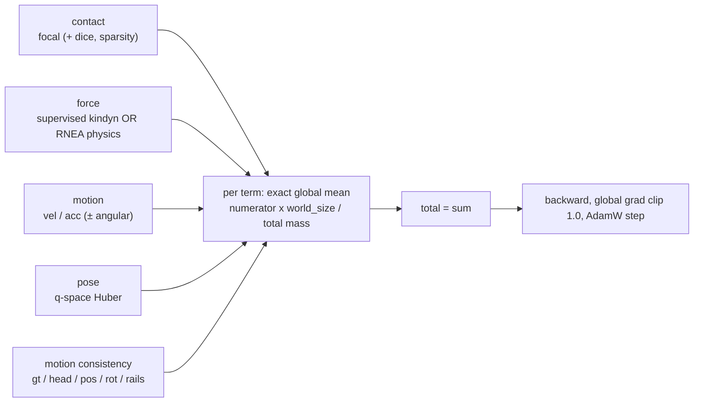

# Losses: every training signal, and where its gradient goes

This page explains what this repository actually optimises. It is a *concepts* page: it says what
each loss compares, which parameters its gradient can reach, and why it is shaped the way it is.
For the modules that produce the predictions see [architecture.md](architecture.md); for the label
sources see [data.md](data.md); for the chronological story of which loss worked when see
[experiments.md](experiments.md); for the full force/physics derivation see [forces.md](forces.md).

## The setting, in one paragraph

The base model is a frozen fork of Meta's **SAM 3D Body** — a single-image human mesh recovery
network that predicts an **MHR** body (Meta Human Rig, the parametric skeleton + skin the base
model was trained on) from one RGB crop. We never train it. Everything on this page supervises
*new* modules bolted on to that frozen model: contact tokens/heads, force tokens/head, motion
tokens/head, and a small number of "bricks" (zero-initialised attention blocks) that mix those
tokens across the frames of a video clip. Two structural rules make the gradient story unusually
clean, and both are enforced by tests:

1. **A name-based freeze filter.** Only parameters whose dotted name contains `contact`, `force`,
   `motion`, `cross_modal` or `pose_temporal` have `requires_grad=True` (plus
   `head_pose_ft_proj` when `train.finetune_pose_head` is on). Everything else — backbone, decoder,
   MHR head, camera head — is frozen and eval-pinned.
2. **An asymmetric decoder attention mask.** Inside the promptable decoder, the original tokens
   never attend the appended contact/force/motion tokens. The frozen pose output therefore has an
   exactly-zero Jacobian with respect to every new parameter, so no loss on this page can move the
   pose *unless* it is routed through the deliberate pose write paths (`pose_temporal`,
   `cross_modal_temporal` listing `pose`, or the pose-head fine-tune flag).

So "which gradient reaches what" is not a vague question here. It is decided by three things: the
freeze filter, the attention mask, and the explicit `.detach()` calls inside each loss module.

## Map of all losses

(Two terms appear throughout before their own sections: **kindyn** is the corpus'
kinodynamics stage — the inverse-dynamics solve whose outputs are this repo's force/motion/pose
ground truth — and a **twist** is a body's 6-D velocity, 3 linear + 3 angular, in its own frame.
Both are treated fully in [data.md](data.md) and the [glossary](glossary.md).)

| Loss | Config section | Compares | Gradient reaches |
|---|---|---|---|
| Contact (focal + dice + sparsity) | `contact.targets.{vertex,joint}.loss` | per-vertex or per-joint contact logits vs binary labels | contact tokens/head (+ whatever feeds them once cross-modal bricks are on) |
| Supervised force | `force_supervision.loss` | 3-D force per limb group vs kindyn GT, body-weight units | force tokens/head only |
| Physics / RNEA residual | `physics.loss` | reconstructed motion's root wrench vs gravity + inertia + predicted forces (no labels) | force tokens/head only in regime (a); leaks into contact in regime (b) |
| Motion supervision | `motion_supervision.loss` | standardized root-frame vel/acc (± angular) vs kindyn twist | motion tokens/head |
| Pose supervision | `pose_supervision.loss` | 125 local MHR `q` channels vs kindyn-MHR pseudo-GT | pose write paths only (`pose_temporal`, cross-modal `pose`, `head_pose_ft_proj`) |
| Motion roll-out | `motion_rollout.loss` | the *predicted velocity integrated* over 3/10/30-frame horizons vs the kindyn root path (`gt`, `rot_gt`) and vs the predicted pose's path (`pose`, `rot_pose`) | motion tokens/head for the GT terms; pose write paths for the pose terms (the integral is detached) |
| Motion consistency | `motion_consistency.loss` | the *predicted* pose, lifted to world and differentiated, vs kindyn GT / the detached motion head, plus absolute root anchors | pose write paths only (the motion head is detached) |


Two of these are mutually exclusive by config validation: `physics.enabled` and
`force_supervision.enabled` cannot both be true (`contact/config.py`). Everything else composes;
the all-modality line ("allmod", shorthand for *all modalities* — one model carrying contact,
force, motion and pose branches at once) runs contact + supervised force + motion + pose together;
the strongest contact+force *specialist* (`corpus6_jf_cond_sum1_postdec`, see
[experiments.md](experiments.md)) runs only the first two.

Two labels recur throughout. **Regime (a)** is the isolated force setup: `train.freeze_contact` is
on, a pretrained contact branch is loaded and frozen, and the force objective is the only one in
the sum. **Regime (b)** is the joint setup: contact and force train together. The distinction
matters mainly for the physics loss, whose gradient isolation is exact only in regime (a).

Every loss module in `contact/` follows the same internal contract, which is worth stating once
because it explains a lot of otherwise-odd code:

- A term is a pair `(weighted_numerator, mass)`. The numerator is an **additive** sum over
  supervised elements (already multiplied by the term's config weight); the mass is the number (or
  total confidence weight) of elements that contributed.
- The reported loss is `numerator / max(mass, 1)`. The pair — not the ratio — is what gets
  all-reduced across GPUs, which is what makes the multi-GPU objective *exactly* the single-process
  objective (§[How the terms combine](#how-the-terms-combine)).
- Every module adds a graph-connected zero (`pred.sum() * 0`; most modules name it `zero_touch`,
  the contact loss builds the same guard inline) to
  its numerators. Under DDP (PyTorch DistributedDataParallel multi-GPU training) with
  `find_unused_parameters=False`, a parameter that never appears in
  the backward graph is a hard error; a batch with nothing to supervise would otherwise drop the
  force or motion head off the graph entirely. The zero keeps them attached without changing any
  value.

## Contact losses

Source: `contact/losses.py` (the objective), `contact/targets.py` (what the labels mean and how
they are assembled).

### What is being predicted

Contact is a per-element binary classification with two possible granularities:

- **`vertex`** — one logit per mesh vertex of the body model: 6890 for **SMPL** or 10475 for
  **SMPL-X** (the two standard parametric human body meshes; SMPL-X adds hands and face). This is
  what the still-image datasets (DAMON, ClimbingImages) label.
- **`joint`** — one logit per semantic joint. Three sets exist: the full SMPL-X **body-22** set
  (the 22 body joints, excluding hands/face), `extremities_4` (`left_hand, right_hand, left_foot,
  right_foot`), and `kindyn_6` (`left_hand, right_hand, left_foot`=toe, `right_foot`,
  `left_ankle`=heel, `right_ankle`), which matches the six force groups one-to-one.

Both targets can be enabled at once; each gets its own `ContactLoss` instance with its own
hyper-parameters, and `MultiTargetContactLoss` returns the sum weighted by
`contact.targets.<name>.weight`.

### Focal loss, and why alpha is above one half

Contact is a rare-positive problem. On a still image only a small fraction of the 6890 vertices
touch anything; on climbing video the four extremities are in contact perhaps half the time, and
individual joints far less. Plain binary cross-entropy on such data is dominated by the easy
negatives.

**Focal loss** (Lin et al., 2017) fixes that with two multipliers on the per-element BCE. Writing
`p` for the predicted probability, `y ∈ {0,1}` for the label and `p_t = p` if `y = 1` else `1 − p`:

```
BCE   = −log(p_t)
focal = α_t · (1 − p_t)^γ · BCE ,      α_t = α·y + (1−α)·(1−y)
```

The `(1 − p_t)^γ` factor is the *focusing* term: a confidently-correct element (`p_t → 1`) has its
loss driven to ~0, so the objective spends its capacity on the hard cases. `α` is the *class
balance* term: `α > 0.5` upweights positives relative to negatives.

The code implements exactly this (`ContactLoss._focal_bce_numerator`), computing `p_t` as
`exp(−BCE)` rather than re-deriving it. `γ = 2` everywhere. `α` is per-target and per-experiment:

- `0.75` — the base default for the `vertex` target (`configs/base.yaml`).
- `0.60` — every shipped climbing joint experiment (`extremities_4` and `kindyn_6` alike). The
  four/six-output heads are far less imbalanced than a 6890-vertex mesh, so a milder positive
  upweight is enough; pushing `α` higher trades precision for recall in a task where false
  positives on a hanging heel are already the dominant error mode (see
  [experiments.md](experiments.md)).

Two optional companions sit next to the focal term:

- **Soft Dice** (`dice_weight`, default `0.5` for vertex): `1 − 2·|p ∩ y| / (|p| + |y|)` computed
  per sample over the supervised elements, i.e. an overlap objective that does not care how many
  negatives there are. It is a set-level complement to focal's element-level view, and it matters
  for the dense vertex head. **Every climbing joint experiment sets it to 0** — with four or six
  outputs a per-sample Dice is noise.
- **L1 sparsity** (`sparsity_weight`, default `0.002` for vertex, `0` for joints): the mean
  predicted probability, penalised directly. A weak prior that contact is rare.

A component whose weight is zero is never evaluated, so the joint configs literally run "focal
only".

### The mask is a confidence weight, not a boolean

Every target contributes `(gt, mask)` of shape `[B, D]`, and `mask` is a **float per-element
supervision weight**, which does four jobs at once:

1. **Missing target** — a still image supplies no joint labels and a video frame supplies no vertex
   labels, so the absent target's mask is all-zero for those rows. This is what lets image and
   video datasets share a batch: each row is supervised only where it has labels.
2. **Unannotated joints** — the *manual test split* (30 climbing scenes a human annotated by hand,
   as opposed to the automatically labelled training scenes) covers only the 14 joints an annotator
   can actually observe; `supervise_subset: observable_14` (or an explicit index list) zeroes the
   rest. See [data.md](data.md).
3. **Partial-evidence reductions** — when body-22 labels are folded into `extremities_4` or
   `kindyn_6`, `reduce_body22_to_groups` uses tri-state OR semantics: a group is a known *positive*
   if any supervised member is positive (even if a sibling is unknown), a known *negative* only if
   every member is supervised and free, and *ignored* otherwise. The mask carries that "known" bit.
4. **Label confidence** — with `use_confidence_weights: true` (all climbing joint experiments) the
   mask becomes `supervised × confidence ∈ [0, 1]`, where the confidence is the label producer's
   own certainty, reduced with max-over-positive-evidence / mean-when-both-known semantics. A
   low-certainty frame then contributes proportionally less to both the numerator and the
   denominator.

Because masked-out logits can be arbitrary (an invalid video frame can produce NaN), the loss
replaces them with zeros before evaluating anything — `NaN × 0` is still `NaN`, so multiplying by
the mask afterwards would not be enough. That is the `safe_logits` line in every component.

Reduction rules, all mask-correct:

- focal and sparsity: `Σ(term · mask) / clamp(Σ mask, min=1)`.
- dice: per-sample dice weighted by that sample's mask mass, divided by the same total mass — so a
  fully-supervised frame keeps the ordinary mean while a mostly-unknown frame is proportionally
  less influential.
- a target with no active element this batch contributes exactly `0.0` — still a tensor function of
  the logits, so `backward()` stays safe.

### Where the contact gradient goes

Into contact-named parameters: the contact tokens, their positional/feature projections, the
per-target heads. Under the default decoder mask
(`extra_token_attention: causal`) the contact tokens attend only the image and themselves, so the
contact loss cannot touch force or motion parameters. Two deliberate exceptions relax that:
`extra_token_attention: mutual` (contact tokens attend force/motion tokens inside the decoder) and
the post-decoder `cross_modal_temporal` block, whose keys and values span the other listed
modalities' tokens. With those on, the contact loss *does* train the listed modalities' parameters
— that is the point of the block. (`mutual` is incompatible with `train.freeze_contact` for the
mirror-image reason: the *frozen* contact tokens would attend the trainable force/motion tokens,
so the frozen contact outputs would drift during force training.)

## Supervised force loss

Source: `contact/force_supervision.py`. Deep reference: [forces.md § Supervised forces from the
corpus](forces.md).

### Units and frame

The head predicts one 3-D vector per limb group in **body-weight (bw) units**: the force in newtons
divided by `m·g` for that person's own solved mass, so `1.0 bw` is a force equal to the climber's
weight. Ground truth comes from **kindyn** — the kinodynamics stage of the sibling video
reconstruction pipeline (BVR), which fits an SMPL-X trajectory to the video and solves inverse
dynamics for per-extremity contact forces. The loader converts kindyn's world-frame newtons to bw
and rotates them into the **body-root frame** with kindyn's own root quaternion, so *no camera
extrinsics appear anywhere in this objective* (extrinsics = the per-frame camera pose relative to
the reconstruction world). The head is configured with `frame: root` and learns that frame
directly.

The six groups, in kindyn's column order, are `left_hand, right_hand, left_foot` (big toe),
`right_foot`, `left_ankle` (heel), `right_ankle`.

### The four terms

**`force`** — smooth-L1 (**Huber**: quadratic within `±δ` of zero, linear beyond, so the mean is
clean near zero but a single spike cannot dominate the gradient) between prediction and GT, summed
over the three components, on valid **in-contact** limb-frames. `huber_delta_bw` is `0.5` in the
defaults and `0.1` in the shipped experiments. Huber rather than L2 because the inverse-dynamics GT has heavy
tails: in-contact `|f|` has a p99 of ≈1.6 bw and a maximum of 48 bw.

**Which contact mask gates it.** The in-contact / non-contact split comes from `force_contact`,
which is kindyn's *own* contact mask — the 52-joint `joint_contact` array stored beside the forces,
bit-identical to `contacts_2.npz` in the *corpus* (the raw ClimbingVideos scene tree this project
reads directly — 331 training and 30 manually annotated test scenes), folded to the six groups. Not
the model's predictions, and not `contacts_1` (the label stream the contact head trains on, which
is the same extractor run on a different body fit). The reason is internal consistency rather than
label quality: the inverse-dynamics solve only ever *placed* a force where its own mask said
contact, so GT is exactly zero everywhere else — by construction, not by measurement. Gating on any
other mask would put in-contact rows with a structurally-zero target into the Huber term and pull
real forces toward zero. The loader asserts the implication (a nonzero force on an uncontacted
group raises).

**Outlier cut.** Limb-frames whose GT magnitude exceeds `outlier_bw` (4.0) are dropped from the
term entirely. Those are solver blowups on bad reconstructions, not physics; Huber alone would
still let them pull.

**`group_weights`** — an optional per-group weighted mean (weights enter both the numerator and the
mass, so upweighting a group buys it proportionally more gradient without changing the term's
scale). Production uses `[1, 1, 2, 2, 2, 2]`, i.e. legs ×2. This is not decoration: with uniform
weights, the very first supervised run collapsed all four leg groups to *exactly* zero output while
the hands learned real signal. Hands dominate both the contact rate and the GT magnitude, so
against the zero-pulling `noncontact` term below, `f = 0` was the mixed-objective optimum for the
legs. Reweighting fixed it (see [experiments.md](experiments.md)).

**`noncontact`** — an L1 penalty on the predicted magnitude at valid **non-contact** limb-frames,
where GT is identically zero by construction. L1 rather than L2 because L1 keeps a constant slope
as `‖f‖ → 0` and therefore admits an *exact* zero, whereas a quadratic shrinkage tax reaches
equilibrium at some nonzero magnitude. Production sets this weight to `0` because the contact gate
(below) does the same job inside the forward pass.

**`sum_force` / `sum_torque`** — consistency terms on the *net* wrench. `sum_force` is a Huber
between `Σ_i f_pred,i` and `Σ_i f_gt,i` over all six groups regardless of the contact mask (GT is
exactly zero off-contact anyway, and a gated prediction is ≈0 there). `sum_torque` is the same on
`Σ_i r_i × f_i`, where `r_i` is the loader's root-frame lever arm from the pelvis to that group's
joint — the *same* arms on both sides, so the choice of origin is a consistency convention, not a
physics claim. A row is skipped when it is force-invalid or when **any** group is an outlier: one
blown-up group poisons the whole sum. Non-finite lever arms additionally skip the torque row (and
are zeroed before the cross product, so `NaN × 0` cannot leak in). Production weights: `sum_force
1.0`, `sum_torque 0.25`.

The `sum_force` weight was raised from 0.25 to 1.0 deliberately. An honest caveat recorded at the
time: by gradient norm, `sum_force` at 0.25 already carried most of the force branch's gradient
(its mass counts rows, while `force`'s mass counts in-contact limb-frames times group weights), so
at 1.0 the ratio is roughly 18:1. The headline monitor (`force_mae`) is weight-free, so this
distorts training-loss curves but not the reported metric.

### Which frames are supervised

`target_frame: center` supervises only row `T//2` of each clip (odd `T` required) — the temporal
module still attends the whole window, so the supervised frame's prediction is informed by its
neighbours, but each clip contributes one labelled row. `all` supervises every row.

### The contact gate

When `model.force_head.contact_gate.enabled` is on (as in the shipped joint experiments), the
*final* force output is

```
f_k = f_raw,k · sigmoid(sharpness · contact_logit_{MAP[k]})      sharpness = 4.0
```

with `MAP` the identity — the six `kindyn_6` contact outputs match the six force groups one-to-one
(heel force gated by ankle contact, toe force by foot contact). The contact logits are
**unconditionally detached** (`sam_3d_body/models/heads/force_head.py`): the force loss must not
rewrite the calibrated contact probabilities through this product. Contact trains from its labels
and nothing else; the gate is a read-only consumer.

Two consequences worth naming. First, the gate replaces the `noncontact` term: a confidently-free
limb is multiplied by ≈0 at inference, rendering and evaluation alike, not merely nudged toward
zero by a penalty. Measured free-limb magnitude went from 0.071 bw (explicit `noncontact` term) to
0.054 bw (gate). Second — reasoning from the code rather than a measurement — the gate also scales
the gradient reaching `f_raw` for that group by the same factor, so a group the contact head is
confident is free receives almost no force gradient. The ungated tensor is kept as
`joint_forces_raw` for diagnostics.

### Gradient reach

Predictions enter with gradients live; GT, contact mask, lever arms and validity bits are plain
batch data. The only trainable parameters on the path are the force tokens, `head_force` and
`cross_modal_temporal` when `force` is a listed modality — plus, through the gate, nothing at all, because of the detach. `force_mae` (mean
`‖pred − gt‖` over in-contact limb-frames, in bw) is computed detached and is the headline monitor
for these runs.

## Physics (RNEA) loss

Source: `contact/physics/loss.py` and `contact/physics/adapter.py`. This is the *label-free*
alternative to the supervised loss above, and it is the older of the two lines. Full derivation,
frames and conventions: [forces.md](forces.md).

### The idea

**RNEA** — the Recursive Newton-Euler Algorithm — is the standard inverse-dynamics recursion: given
a rigid multibody's configuration `q`, velocity `v`, acceleration `a`, gravity, and any external
wrenches, it returns the joint torques (and base wrench) required to produce that motion. Run it on
a **free-flyer** base — a floating root with 6 unactuated degrees of freedom, i.e. a body that
nothing holds up from the inside — and the first six components of the result are the wrench the
world would have to apply *directly at the pelvis* to explain the observed motion.

For a real climber that wrench must be zero: nothing grabs them by the pelvis. Everything holding
them up is gravity, their own inertia, and the contact forces at hands and feet. So the
*root-wrench residual*

```
r(f) = RNEA_root( q, v, a, gravity, f_ext(f) )        should be 0
```

is a physics-derived supervision signal for the predicted forces `f`, with no force labels
anywhere. That is the whole idea; the rest is making it computable and stable.

### The pipeline per batch

1. **Eligibility.** Only video clips with `T ≥ physics.min_frames`, all frames valid and all frames
   camera-valid participate. Still images (`T = 1`) contribute zero. A clip that looks eligible but
   lacks the camera export *raises* rather than silently no-op'ing. An optional camera-jerk filter
   (`max_cam_jump_m`) drops clips whose camera centre jumps between consecutive sampled frames —
   reconstruction discontinuities alias straight into body acceleration.
2. **Trajectory.** `MHRAdapter` maps the frozen model's per-frame MHR parameters plus the dataset
   camera extrinsics onto a BetterHuman MHR body and a world-frame configuration trajectory `q`.
   Everything it consumes is **detached** — MHR parameters, shape, camera translation, extrinsics.
3. **Smoothing.** Composed on the manifold: a linear windowed mean for the root translation and the
   125 revolute channels, a hemisphere-aligned slerp mean for the root quaternion. Default kernel
   `[0.25, 0.5, 0.25]`.
4. **Derivatives.** Manifold central differences honouring the real per-interval `dt` from
   `frame_pos_sec` (clips are not uniformly sampled across the corpus).
5. **Residual frames.** A frame contributes only if its whole stencil is inside the clip: the
   smoothing radius `r` per side, plus two frames for the doubled central difference (velocity
   needs `±1`, acceleration of velocity another `±1`). The supervised set is `{t : 2+r ≤ t ≤
   T−3−r}` — with the default kernel that needs `T ≥ 7` to supervise anything at all.
6. **External wrenches.** `f_newtons = pred · m · g`, placed at the four extremity joint origins as
   pure forces (zero torque), rotated from the head's output frame to world and then into each
   joint's local frame.
7. **Residual.** Gravity is per clip (magnitude from config, direction from the scene's
   `gravity_world`), applied without mutating global state. `tau[:6]` is the root residual;
   `tau[6:]` the joint torques.

Every term is **dimensionless**: the residual force is divided by `m·g`, torques by `m·g·1 m`, and
the predictions are already in bw. That is what makes the weights below comparable across people of
different mass.

### The terms

| Term | Default | What it does |
|---|---|---|
| `residual` | 1.0 | `Σ ρ(r_force) + ρ(r_torque)` on the normalised root wrench. `ρ` is `square` by default, or a component-wise `pseudo_huber` (smooth everywhere, linear past `δ`) to tame the heavy tail from double finite-differencing. Separate `residual_force_weight` / `residual_torque_weight` exist because the per-limb *allocation* signal lives in the torque part, which measured ~23× weaker than the force sum (median 0.033 vs 0.74; the config comment rounds to 20×). |
| `force_noncontact` | 1.0 | Penalise force on limbs the model believes are free. Two forms: `soft_l2` = `(1−p)·‖f‖²` (shrinks, never reaches zero) and `hinge_l1` = `hinge(p)·‖f‖` (full penalty below `p_lo`, zero above `p_hi`, linear between) whose constant slope at `‖f‖ → 0` admits exact zeros. |
| `force_at_contact` | 0.1 | `p·relu(contact_min_bw − ‖f‖)²` — a weak floor so a believed contact is not zero-force. |
| `force_smooth` | 0.1 | `‖f_t − f_{t−1}‖²` on world-frame forces. |
| `force_l2` | 0.01 | Plain magnitude regulariser over all frames. |
| `torque_l2` / `torque_smooth` | 0.01 / 0.0 | Same on the *joint* torques RNEA returns. |

Alongside these, a `raw_residual` diagnostic always reports the **unweighted, un-robustified**
physical residual: that is the number comparable across configurations (the zero-force baseline was recorded as
≈2.586 during the collapse investigation; the run artifacts behind it are no longer on disk), and
it is what the `physics_residual` monitor reads.

### D8: gate on predictions, not labels

The prob-gated terms use `out["contact"]["joint_probs"]`, **detached** — the model's own contact
belief, not the dataset's contact labels. This is a deliberate decision (recorded as D8 in the
project's decision log). The video contact labels are motion-gated *stable contact*: a limb counts
as "in contact" only after a stillness/hysteresis/min-duration estimator says so. That is a
different quantity from instantaneous load. A hand can be bearing force in the frame before the
label turns on, and can be resting on a hold with the label on while bearing nothing. Gating a
*force* objective on that label would inject a systematic timing error; gating on the model's own
per-frame probability at least gates on something instantaneous. `gate_frames: residual` optionally
restricts the gated terms to the residual (centre) frames, because with a windowed temporal contact
model only those frames' probabilities are in-distribution.

### Gradient isolation, and the known leak

Everything the physics loss consumes except the force prediction is detached: MHR parameters,
shape, `pred_cam_t`, `cam_from_world`, `gravity_world`, and the contact probabilities. In **regime
(a)** — `train.freeze_contact: true`, contact frozen, force the only trainable branch — the physics
gradient therefore reaches force parameters and nothing else, exactly.

In **regime (b)** — contact trainable alongside force — the isolation from the *contact head*
breaks, and the code says so. The decoder's block mask permits a later appended block to attend an
earlier one, and force comes after contact, so the force tokens read the contact tokens. A physics
gradient therefore flows backwards through that attention into trainable contact parameters: the
contact head would be trained by both its labels and the physics residual. The trainer prints a
loud warning rather than raising, because a joint regime might be intended; the detach-fix is
deferred. (The supervised force loss does not have this problem for the *gate* — that path is
detached — but the same attention route exists there too.)

The physics line was eventually superseded by the supervised kindyn forces in the current lines;
[forces.md](forces.md) and [experiments.md](experiments.md) record why (in short: the residual
turned out to be badly conditioned for per-limb allocation, and the collapse modes were hard to
distinguish from success).

## Motion supervision

Source: `contact/motion_supervision.py`; target derivation lives in the corpus loader
(`contact/data/climbing_corpus.py`).

### What a twist is, and which one we use

The motion head regresses per-slot linear velocity and acceleration in **body-root axes** — i.e.
the pelvis's own frame, not the world's and not the camera's. The pelvis slot's target is a **body
twist**: the velocity of a rigid frame expressed in that frame itself, obtained from finite
differences taken *on the SE(3) manifold* rather than on positions:

```
d[t] = log( T_t^{-1} · T_{t+1} )
v[t] = ( d[t−1] + d[t] ) / 2Δt
a[t] = ( d[t] − d[t−1] ) / Δt²
```

This is exactly the stencil BVR used when it differentiated its own fit, so the target matches the
producer. The six limb slots use the simpler `rotated_world` convention (world central differences
rotated into root axes); BVR defines no linear twist for non-root joints. The two conventions
differ by the Coriolis term `ω × v`, about 7% of `|a|` — small, but it is why the diagnostics
re-apply that term when converting predictions and targets to world axes for correlation reporting.

### The gravity-view frame

A third convention, `gravity_view`, changes the axes the **linear** part is expressed in — not the
motion it describes. It is GVHMR's Gravity-View frame: the vertical axis is the scene's gravity
(down-positive) and the azimuth is the camera's view direction projected onto the horizontal plane,
so the frame is gravity-aligned, defined per frame, and independent of both the arbitrary world
azimuth and the body's pose. Two things follow, and they are the whole reason to use it:

- **Pose error stops rotating the target.** In body axes the target is `R_root^T v_world`, so a
  fifteen-degree pelvis orientation error scores a perfect world velocity as wrong — and the GT
  rotation carries the fit's own orientation error into every label. In a gravity frame only the
  azimuth matters; roll and pitch drop out.
- **The vertical becomes a channel.** Gravity is the one direction where the dynamics is
  asymmetric, and it is the direction the force and contact heads care about. In body axes
  "she is descending" is smeared across all three components as a function of pelvis orientation.

The target is the *same* body twist, re-expressed: `world = R_root (a_body + ω × v_body)` (velocity
without the Coriolis term), then into gravity-view axes. It therefore keeps the 0.12 s smoothing
below — rotating the raw central difference instead would silently drop it and inflate `|a|` about
fourfold. The angular pair is the SE(3)-log body rate under every convention, untouched.

Gravity comes from the scene's **fitted** `gravity_world` in `kindyn_1.npz`, not from a constant:
over the 864 train scenes the tilt away from world-y has median 3.2°, p90 27.5° and a 61.4° maximum,
and 163 scenes are past 15°. That measurement is also why the loss's world-vertical diagnostics now
project onto that vector instead of taking the world-y component, as the pre-regeneration code did.

Because the frame changes what each channel means, `standardize` is **frame-specific** and has to be
recomputed when the convention changes (`output/gv_stats/motion_gv_standardize.json` holds the
gravity-view table, over the same 273,039 rows as the body-frame one; its angular rows come out
bit-identical, which is the cross-check that only the linear frame moved).

### σ = 0.12 s label smoothing

The single most important design choice here is not in the loss at all — it is in the target. The
kindyn trajectory is Gaussian-smoothed at a **fixed physical width of 0.12 seconds** before being
differentiated (`motion_supervision.target_smooth_sec`, applied by the loader, gap-aware, with
quaternions hemisphere-aligned before smoothing and renormalised after).

The reason is that the corpus spans heterogeneous frame rates, and raw finite differences of a
per-frame fit are dominated by sampling-rate artefacts: raw pelvis `|a|` RMS runs 3.4 m/s² at 24
fps against 13.3 m/s² at 60 fps *for the same kind of climbing*. Training on that teaches the
network the frame rate, not the motion. A fixed-seconds width makes the label bandwidth
fps-independent (smoothed `|a|` RMS lands in 2.1–2.5 across the whole fps range), and a per-scene
stride keeps a clip covering the same physical span everywhere. Before this change the motion head
learned essentially nothing; after it, pelvis acceleration correlation went to `r3d` ≈ 0.345
(the pooled Pearson correlation over all three spatial components of the target) against
a mean-prior floor of 0.018 and a predict-the-smoothed-signal ceiling of 0.671.

The same audit found the other reason raw targets were hopeless: two-thirds of raw pelvis
acceleration variance is coherent camera-depth wobble (lag-1 autocorrelation +0.62), not white
jitter — i.e. reconstruction error that no amount of averaging inside the loss can remove.

### The loss itself

The head outputs **standardized** values; the GT arrives in physical units (m/s, m/s²) and is
standardized inside the loss with a mean/std table pinned in the experiment yaml. Pinning matters
for reproducibility: a registered buffer would not survive the trainable-only checkpoint, so a
checkpoint's stored config alone must reproduce the objective.

Standardization is **per joint and per component**, which is the point: the wrists' root-frame
acceleration std is ~2.5× the pelvis's, so a single global scaler would let the limbs drown the
pelvis — the slot that carries the comparison bar.

Terms are Huber (`huber_delta` = 1.0 in standardized units) summed over each 3-vector: `vel` and
`acc` always, plus `ang_vel` and `ang_acc` when `motion_supervision.angular` is on (a 12-wide
pelvis target: the root twist's angular velocity and acceleration straight from the SE(3) log).
Production down-weights the angular pair to 0.5 — full-weight angular supervision cost linear
velocity accuracy.

Masking: an entry contributes when its frame is motion-valid (central-difference support present,
outside scene-edge and gap trims) **and** frame-valid. During training an extra per-`(frame,
joint)` outlier bit — set by the loader when `|acc_world|` exceeds `outlier_acc_ms2` (50 m/s²,
kindyn's `1/dt²` jitter on 50/60-fps scenes) — zeroes *both* the vel and acc terms of that entry,
since one position spike contaminates both. **Evaluation never filters**
(`exclude_outliers=False`), so the reported numbers are on the unedited distribution.

Diagnostics are de-standardized and returned as raw sufficient statistics (counts, sums, sums of
squares, cross-products) so the trainer can all-reduce them into an exact global Pearson
correlation and RMSE rather than averaging per-rank correlations, which is not a valid operation.

Gradient reach: motion tokens, `head_motion`, and `cross_modal_temporal` (which a
motion-supervised config must enable with `motion` listed — a per-frame head cannot represent a
derivative).

## Pose supervision

Source: `contact/pose_supervision.py`.

This is the only loss that deliberately moves the pose, and it exists because the pose write paths
(`pose_temporal`, `cross_modal_temporal` listing `pose`, `train.finetune_pose_head`) would otherwise
have no objective at all — the config validator refuses to enable them without it.

The pseudo-ground-truth is the kindyn SMPL-X trajectory refit as a world-frame MHR configuration
(`scripts/convert_kindyn_to_mhr.py` writes `mhr_1.npz` per scene, ~0.5 cm joint residual). The
comparison runs in **`q` space** — the rig's own configuration manifold — not in the model's
parameter space. That is a correctness requirement, not a preference: the MHR head's 260 continuous body-pose
outputs convert to 130 parameter slots that project onto a 125-dimensional `q` manifold, with the last six slots
coupled such that `to_classic(from_classic(p)) ≠ p`. A parameter-space loss would chase components
the rig cannot represent.

The supervised slice is `q[7:132]` — 125 channels. The first seven are the **free-flyer** root: the
6-DoF floating base of the kinematic tree, stored as a 3-vector translation plus a 4-component
quaternion. It is never supervised, because the prediction's root lives in camera frame and the
target's in the reconstruction world; they are simply not comparable without the extrinsics this
objective deliberately avoids.

Two terms:

- **`pose`** — per-frame Huber (`huber_delta` 0.1 rad) on the channel differences, wrapped to
  `(−π, π]` since these are euler-like channels.
- **`acc`** (default 0, opt-in) — a Huber on the clip-wise **second differences** of the `q`
  channels, prediction versus target, over valid frame triples. The per-frame term alone pulls the
  pose toward kindyn without smoothing it: in the first pose-temporal experiment the per-frame MAE
  improved from 0.096 to 0.070 rad while the prediction's acceleration RMS stayed ~5.7× kindyn's.
  `acc` is the explicit smoothness objective for that gap.

The shape input to the parameter→`q` conversion is detached (`q` is shape-independent by the
adapter's invariant, so the identity used for the conversion is irrelevant). Gradient reaches the
pose write paths only.

## Motion roll-out loss

Source: `contact/motion_rollout.py`, config section `motion_rollout`. The mirror image of the
motion-consistency loss below: that one differentiates the predicted pose and compares twists, this
one **integrates** the predicted velocity and compares positions.

The motivation is bandwidth. Differentiating amplifies exactly the frequencies where the pseudo-GT
is worst — two thirds of raw pelvis acceleration variance is coherent camera-depth wobble.
Integrating suppresses them, and asks a question no per-frame derivative loss can ask: *did the body
actually travel this far over this second?* It is also what makes GVHMR world-grounded — it rolls
its predicted per-frame displacement out into a trajectory and supervises the translation directly.

**What is compared.** The predicted velocity is rotated to the world with `motion_lin_rot` (the
frame the target itself lives in) and integrated with the trapezoid rule over the clip's real
elapsed seconds. Only **displacements over a horizon** are compared — `path[t+H] − path[t]` — never
absolute positions, so the constant of integration never enters the loss; absolute placement stays
the job of the keypoint anchors. Several horizons run at once (default 3, 10 and 30 frames): short
ones say roughly what the derivative loss says, long ones carry the low-frequency constraint that is
the point of the exercise.

**The four terms.** `gt` compares against the kindyn root path, with the gradient reaching the
motion head — a low-frequency supervision signal the per-frame Huber cannot give. `pose` compares
against the root path implied by the *predicted* pose; with `detach_head` (the default) the
integrated side is detached, so the pose trajectory is pulled toward the head's smoother estimate
and never the reverse. `rot_gt` and `rot_pose` are the same two comparisons for orientation: the
predicted body rate composed over the horizon as `∏ exp(ω dt)` — body rates multiply on the right —
against the GT or predicted relative rotation, compared geodesically.

**Why it requires `gravity_view`.** Rolling out a body-frame velocity means rotating each step by
the predicted body orientation, so the integral compounds the pose's orientation error — the very
error the loss is trying to measure. A gravity-view velocity needs only the frame's azimuth, which
comes from the camera, so the integral is independent of the predicted body orientation. The config
validator enforces the pairing; the two ideas are one change, not two.

## Motion-consistency loss

Source: `contact/motion_consistency.py`. This section is the summary; the loss has its own
deep-dive page, [consistency.md](consistency.md), with the world-lift geometry, the term-by-term
detail, the diagnostics, and the open problems. It has the most history of any loss, and the
honest summary up front: **it has never beaten the no-consistency baseline on contact, force or motion.** It is
documented here because its failure modes are instructive and because its remaining rationale —
world-trajectory pose quality — is not something the other losses measure.

### What it compares

The idea is a self-consistency constraint between two things the model already predicts: if the
pose path says where the body is in each frame, then differentiating that trajectory should give
the same motion the motion head predicts, and the same motion kindyn measured.

Concretely, per frame, the *predicted* pelvis is lifted into the metric reconstruction world using
the dataset extrinsics:

```
p_world = R_ext^T · ( mean(kp3d[9], kp3d[10]) + pred_cam_t − t_ext )
R_world_from_root = R_ext^T · diag(1,−1,−1) · euler_xyz(global_rot)
```

(keypoints 9 and 10 are the left/right hips in MHR70, the 70-keypoint layout the pose head emits,
and they leave the MHR
head already in camera axes; `global_rot` is a native-axes euler triple, hence the flip). This
composition was verified against a stored geometry artifact to 2.4e-7 m. Everything on that path is
differentiable, and — a load-bearing detail — the recompute hook that rebuilds the final MHR output
from an updated pose token rebuilds the *camera* head too, so `pred_cam_t` really is a function of
the pose bricks.

The lifted trajectory is then differentiated with the **same** BVR body-twist stencil the motion
targets use (torch mirrors of the loader's lie-group math, parity-tested), standardized with the
`motion_supervision` pelvis table, and compared.

### The two consistency terms

- **`gt`** — pose-derived twist vs the kindyn GT twist. The failure it attacks is depth wobble:
  world-position jitter that reprojects perfectly well in 2-D but differentiates into enormous
  accelerations.
- **`head`** — pose-derived twist vs the motion head's own prediction, **detached**. The detach is
  the whole design of this term: the pose-derived twist is pulled toward the motion estimate, never
  the reverse. The motion head learns from `motion_supervision` alone, so a degenerate pose
  trajectory cannot drag it down. This was not the original design — v2 had no detach, and the
  motion head was duly dragged into the collapse described below.

`angular: false` (the current stance) restricts both terms to the **linear** rows even when the
motion head is trained on 12 dimensions. The angular residuals are the frozen model's ~7°/frame
orientation wobble differentiated at 30 fps and then divided by a small GT angular std — the
resulting numbers are huge, and the cheapest way to make them small is to hold the orientation
*constant*. Which is exactly what happened; see below.

### Why derivative-only supervision has null spaces

A derivative objective cannot see a constant. Under a static camera, a *constant* `pred_cam_t`
contributes exactly nothing to world velocity — so "collapse the camera translation to a fixed
value" is a free way to kill depth wobble, and `q`-space pose supervision (which never touches the
free-flyer root) is blind to it. The v2 run took that route: `pred_cam_t` collapsed to a constant
at 9 cm depth (versus a sane ~5.5 m), 2-D keypoints landed ~12,000 px off the person, and — through
the un-detached `head` term — the motion head followed the depth-dead twist down.

Four anchor terms close the null spaces:

- **`pos`** — predicted world mean-hips versus the kindyn root position lifted to the same point
  (`p_gt + R_gt · hip_offset_root`, where the constant offset ≈ 9 cm was measured on the geometry
  artifact). Huber in metres, on every valid row: no stencil, so clip boundaries *are* supervised
  here.
- **`rot`** — the geodesic residual `so3_log(R_pred^T R_gt)` against zero, Huber in radians.
- **`cam_rail`** — a **trust region**, not a target: `relu(‖pred_cam_t − pred_cam_t_frozen‖ −
  margin)`, exactly zero inside `cam_rail_margin_m` (0.5 m) and linear beyond. The anchor is the
  *frozen* model's own camera translation, stashed by the recompute hook as `pred_cam_t_frozen`.
  For a healthy model the rail is inert; it simply makes the collapse optimum unreachable.
- **`rot_rail`** — the same trust region on `global_rot` against the stashed `global_rot_frozen`,
  in geodesic radians (margin 0.2 rad). v3 proved this was needed: with only the camera railed, the
  twist terms pinned the world orientation near-constant (per-clip spread 0.21° against a GT 2.85°)
  and parked it ~55° away from the truth. Rotation was simply the next open escape channel.

Terms are masked as follows: the twist terms need stencil support (frames `t−1, t, t+1` all real
and extrinsics-valid), so clip boundaries are never twist-supervised and `frames_per_clip ≥ 3` is
required; the anchors are per-frame and include boundaries; the rails vanish entirely when there is
no pose write path (no `pred_cam_t_frozen` stashed means nothing can drift).

### Gradient reach, and the honest verdict

Gradients from every term reach the **pose path only** — the motion head's contribution is detached
and a dedicated test asserts no gradient reaches `head_motion`. The GT, extrinsics and root anchors
are plain data.

Results, at matched epochs against the same recipe without this loss: v2 (no anchors, un-detached
head) lost on every axis and produced the camera collapse; v3 (anchors + rails + detach) fixed the
camera but collapsed the rotation; v4 (linear-only + rotation rail) closed the brick-level rotation
escape and immediately exposed a third route — with `train.finetune_pose_head` on, the rails anchor
to a predecessor computed with the *current* fine-tuned head, so head drift moves the anchor along
with the offender and the rails structurally cannot see it. Orientation error against GT climbed
6.7° → 28° in two epochs. The pattern is whack-a-mole: v2 camera → v3 rotation → v4 head drift. The
full chronology, with numbers, is in [experiments.md](experiments.md).

## How the terms combine

### Per-module: weighted, normalised, summed

Each loss module owns its internal weighting. A module's total is `Σ_terms weight_i · numerator_i /
max(mass_i, 1)` — note that each term is normalised by **its own** mass, not a shared one, because
different terms are supervised on different row sets (in-contact limb-frames, all frames, residual
frames, valid triples).

A term whose configured weight is zero is skipped entirely. A term with a nonzero weight is
**always present** even when it has no data this batch (mass 0, numerator = the graph-connected
zero), because DDP requires every rank to all-reduce the same set of terms in the same order.

### Across modules: a plain sum

`scripts/train.py` builds the objective as

```
total = [contact loss] + [physics | force_supervision] + [motion] + [pose] + [consistency]
```

with **no top-level relative weights** between the modalities. The only levers are the weights
inside each module and the per-target `contact.targets.*.weight`. In regime (a)
(`train.freeze_contact`) the contact loss is dropped from the sum entirely — its parameters are
frozen — while its metrics keep being logged.



### The DDP contract, and why exactness matters

Each term exposes `(weighted_numerator_tensor, weight_mass)`. Under multi-GPU DDP the trainer
all-reduces the masses, then rescales each rank's local numerator:

```
term_rank = local_numerator · world_size / clamp(global_mass, min=1)
```

DDP averages gradients across ranks, dividing by `world_size`; multiplying by `world_size` first
cancels that, so the averaged gradient equals `Σ_ranks numerator / Σ_ranks mass` — the exact global
weighted mean, identical to what a single process with the same global batch would compute.

This is not pedantry. The naive alternative — let each rank compute its own normalised mean and let
DDP average them — weights every rank equally regardless of how much supervision it actually held,
and this repository's masses are wildly uneven by construction: confidence weights are fractional,
still-image rows carry no joint labels, video rows carry no vertex labels, physics eligibility
depends on clip length and camera validity, and a rank can easily end up with **zero** supervised
elements (where the naive mean is not even defined). The `clamp(mass, min=1)` and the
`ddp_global_mean_term` helper are what make a rank with 0.3 total confidence mass, or none at all,
contribute correctly instead of catastrophically.

The same numerator/mass pairs are accumulated on the evaluation side and all-reduced with SUM, so
reported metrics (`force_mae`, physics residual, Pearson correlations, pose MAE) are exact global
quantities rather than averages of per-rank averages.

### Around the optimiser step

- The total is checked for finiteness every step, all-reduced with MIN so one rank's NaN stops
  everyone, and a non-finite loss raises before any optimiser step.
- If a batch has **no active supervision anywhere** (all-invalid video window, physics-ineligible
  clip), the step is skipped rather than executed with a zero gradient — AdamW's weight decay would
  otherwise still nudge the weights on a batch that taught nothing.
- Gradients are clipped to a global norm of `loss.grad_clip` (1.0) over the trainable parameters.
  Both the raw and post-clip norms are logged, and the finiteness check runs on the **raw** norm:
  an infinite raw norm makes the clip scale gradients by 0 or NaN while the reported post-clip
  value `min(inf, 1.0)` would look perfectly healthy.

## Where to read next

- [forces.md](forces.md) — the full physics derivation, frames, units, and the supervised-force
  deep dive including the gate and sum-consistency terms.
- [data.md](data.md) — what the labels actually mean: automatic "stable contact", the manual test
  annotations, kindyn's own contact mask, and the splits.
- [architecture.md](architecture.md) — the modules these losses train and the masks that isolate
  them.
- [experiments.md](experiments.md) — which of these signals worked, in what order, and what broke.
